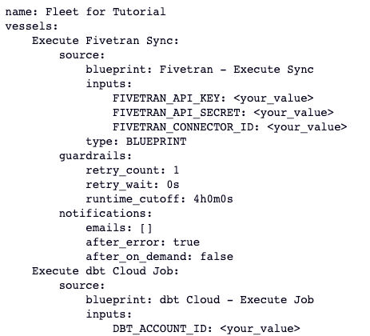
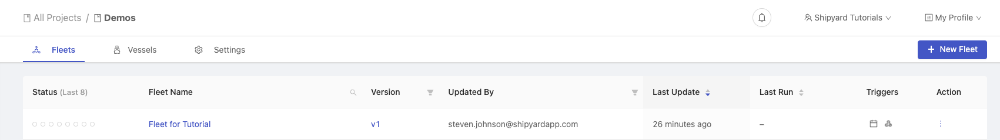

# Create a Fleet using the API

## Overview

In this tutorial, we will walk through the steps needed to create a Fleet using an API call. The tutorial will provide an example YAML for the Fleet, however the steps will work with any YAML. 

By the end of this tutorial, you'll be able to: 

- Call the Shipyard API to create a Fleet

## Setup

:::note
The calls to the Shipyard API will be completed in Hex in this tutorial. However, the steps can be completed in any Python coding environment.
:::

First, download the [yaml code](https://drive.google.com/file/d/1HKUaep0Jeh-RXVLkhtU-ewd6SKzUIDoq/view?usp=sharing) named `tutorial.yaml`. This is the YAML file that will create the Fleet in Shipyard.

Feel free to peruse this YAML beforehand so you understand everything that it's doing. The YAML creates three Vessels in a Fleet:
1. Execute Fivetran Sync
2. Execute dbt Cloud Job
3. Trigger Tableau Datasource Refresh

:::tip
The YAML as created does not have any inputs for the Fleet. If you have inputs for the three services in the example, feel free to input values for the Blueprints.
:::

## Steps

1. Copy and paste the following code into your coding environment: 

```python
import requests

headers = {
    'X-Shipyard-API-Key': '<Your-API-Key>',
    'Content-Type': 'application/x-www-form-urlencoded',
}

with open('tutorial.yaml', 'rb') as f:
    data = f.read()

response = requests.put(
    'https://api.app.shipyardapp.com/orgs/<Your-Org-ID>/projects/<Your-Project-ID>/fleets',
    headers=headers,
    data=data,
)

print(response.text)
```

```note
The python script above uses the Python Requests module to send the YAML to Shipyard to create a Fleet.
```

2. Insert your Shipyard API Key, Organization ID, and Project ID into the code that you pasted. 
3. Run the script. You will receive the YAML printed back to you with the print statement at the end of the script if the API call is successful. 



4. Head into Shipyard and the specific Project from the ID you inputted into the Python script earlier. You should see the Fleet listed in the Project now.



5. Click the Fleet name to open the Fleet Builder where you can enter any inputs that you left blank from the initial YAML.

:::tip Success
You've successfully created a Fleet using a Shipyard API call.
:::