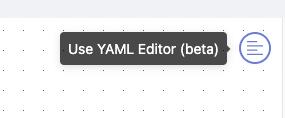

# Creating a Fleet with the YAML Editor

## Overview

In this tutorial, you'll walk through the steps to duplicate a fleet using Platform's [YAML Editor](../reference/fleets/yaml-editor.md). 

By the end of this tutorial, you'll be able to: 

- Create a Fleet with the YAML Editor
- Duplicate Fleets 

For more information about our YAML Editor, check out this [blog post](https://www.shipyardapp.com/blog/facilitating-workflow-as-code/) that covers the basics of using the YAML Editor.

## Steps

### Step 1 - Create New Fleet with YAML Editor

1. Click the **New Fleet** button on the top left corner of the Platform webpage.
2. Click the **Use YAML Editor** button on the top right of the Fleet Builder page



3. Highlight and delete all of the existing YAML.
4. Copy the following YAML and paste it into the YAML Editor: 
```yaml
name: Download Slinky Dog Dash Ride Wait Times
_id: f7cea97e-ee68-4b3e-9eba-76114694e555
vessels:
    Download Slinky Dog Dash Ride Data:
        _id: a8ca098c-0e0e-4e2f-a310-6d2e14e7d690
        source:
            blueprint: HTTP - Download File from URL
            inputs:
                HTTP_DESTINATION_FILE_NAME: slinky_dog.csv
                HTTP_DESTINATION_FOLDER_NAME: disney_world_wait_times
                HTTP_FILE_URL: https://cdn.touringplans.com/datasets/slinky_dog.csv
            type: BLUEPRINT
        guardrails:
            retry_count: 0
            retry_wait: 0s
            runtime_cutoff: 4h0m0s
        notifications:
            emails:
                - tutorials@shipyardapp.com
            after_error: true
            after_on_demand: false
    Send Slinky Dog Dash Data via Email:
        _id: 4c1a1d9d-3be4-4560-888a-cf37d3101131
        source:
            blueprint: Email - Send Message with File
            inputs:
                EMAIL_BCC: null
                EMAIL_CC: null
                EMAIL_INCLUDE_SHIPYARD_FOOTER: true
                EMAIL_MESSAGE: Here's the most recent wait times for Slinky Dog Dash!
                EMAIL_PASSWORD: SHIPYARD_HIDDEN
                EMAIL_SEND_METHOD: tls
                EMAIL_SENDER_ADDRESS: ${EMAIL_USERNAME}
                EMAIL_SENDER_NAME: null
                EMAIL_SMTP_HOST: smtp.gmail.com
                EMAIL_SMTP_PORT: "587"
                EMAIL_SOURCE_FILE_NAME: slinky_dog.csv
                EMAIL_SOURCE_FILE_NAME_MATCH_TYPE: exact_match
                EMAIL_SOURCE_FOLDER_NAME: disney_world_wait_times
                EMAIL_SUBJECT: Slinky Dog Dash Wait Times
                EMAIL_TO: shipyardapptest@gmail.com
                EMAIL_USERNAME: shipyardapptest@gmail.com
            type: BLUEPRINT
        guardrails:
            retry_count: 0
            retry_wait: 0s
            runtime_cutoff: 4h0m0s
        notifications:
            emails:
                - tutorials@shipyardapp.com
            after_error: true
            after_on_demand: false
connections:
    Download Slinky Dog Dash Ride Data:
        Send Slinky Dog Dash Data via Email: SUCCESS
notifications:
    emails:
        - tutorials@shipyardapp.com
    after_error: true
    after_on_demand: false
```

### Step 2 - Use YAML Editor to Edit Fleet

1. For name, change `Download Slinky Dog Dash Ride Wait Times` to `Download Space Mountain Ride Data`.
2. Under vessels, change `Download Slinky Dog Dash Ride Data` to `Download Space Mountain Ride Data`
3. Under that Vessel, change the following inputs to the values listed:

| Input                       | Value                                                    |
|-----------------------------|----------------------------------------------------------|
| HTTP _DESTINATION_FILE_NAME | `space_mountain.csv`                                    |
| HTTP _FILE_URL              | `https://cdn.touringplans.com/datasets/space_mountain.csv` |


4. Change the second Vessel's name from `Send Slinky Dog Dash Data via Email` to `Send Space Mountain Data via Email`
5. Under that Vessel, change the following inputs to the values listed:

| Input                  | Value                                                 |
|------------------------|-------------------------------------------------------|
| EMAIL_MESSAGE          | `Here's the most recent wait times for Space Mountain!` |
| EMAIL_SOURCE_FILE_NAME | `space_mountain.csv`                                    |
| EMAIL_SUBJECT          | `Space Mountain Wait Times`                             |


6. Under Connections, change the names of the two vessels to match our new vessels:

| Original Name                                | New Name                                 |
|-------------------------------------|------------------------------------|
| Download Slinky Dog Dash Ride Data  | Download Space Mountain Ride Data  |
| Send Slinky Dog Dash Data via Email | Send Space Mountain Data via Email |


7. Find all of the values in the YAML called `_id` and delete the full line. Platform will automatically generate new ids for the new Space Mountain Fleet.

:::warning
A YAML with IDs is used when updating an existing Fleet. If you try to create a new Fleet with IDs, it will error out.
:::

Your finished YAML for the Space Mountain Fleet should look like this:

```yaml
name: Download Space Mountain Ride Data
vessels:
    Download Space Mountain Ride Data:
        source:
            blueprint: HTTP - Download File from URL
            inputs:
                HTTP_DESTINATION_FILE_NAME: space_mountain.csv
                HTTP_DESTINATION_FOLDER_NAME: disney_world_wait_times
                HTTP_FILE_URL: https://cdn.touringplans.com/datasets/space_mountain.csv
            type: BLUEPRINT
        guardrails:
            retry_count: 0
            retry_wait: 0s
            runtime_cutoff: 4h0m0s
        notifications:
            emails:
                - tutorials@shipyardapp.com
            after_error: true
            after_on_demand: false
    Send Space Mountain Data via Email:
        source:
            blueprint: Email - Send Message with File
            inputs:
                EMAIL_BCC: null
                EMAIL_CC: null
                EMAIL_INCLUDE_SHIPYARD_FOOTER: true
                EMAIL_MESSAGE: Here's the most recent wait times for Space Mountain!
                EMAIL_PASSWORD: SHIPYARD_HIDDEN
                EMAIL_SEND_METHOD: tls
                EMAIL_SENDER_ADDRESS: ${EMAIL_USERNAME}
                EMAIL_SENDER_NAME: null
                EMAIL_SMTP_HOST: smtp.gmail.com
                EMAIL_SMTP_PORT: "587"
                EMAIL_SOURCE_FILE_NAME: space_mountain.csv
                EMAIL_SOURCE_FILE_NAME_MATCH_TYPE: exact_match
                EMAIL_SOURCE_FOLDER_NAME: disney_world_wait_times
                EMAIL_SUBJECT: Space Mountain Wait Times
                EMAIL_TO: steven.johnson@shipyardapp.com
                EMAIL_USERNAME: shipyardapptest@gmail.com
            type: BLUEPRINT
        guardrails:
            retry_count: 0
            retry_wait: 0s
            runtime_cutoff: 4h0m0s
        notifications:
            emails:
                - tutorials@shipyardapp.com
            after_error: true
            after_on_demand: false
connections:
    Download Space Mountain Ride Data:
        Send Space Mountain Data via Email: SUCCESS
triggers:
    schedules:
        - how_often: WEEKLY
          when: MONDAY
          at: :00
notifications:
    emails:
        - tutorials@shipyardapp.com
    after_error: true
    after_on_demand: false
```

8.  Click **Save & Finish** on the bottom right corner of the Platform webpage. This will take you to a page that says the Fleet has been created successfully.


:::tip Success

You've successfully created a Fleet with the YAML Editor!

:::


