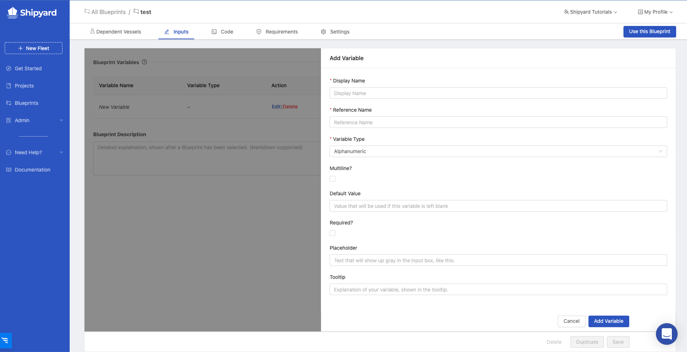
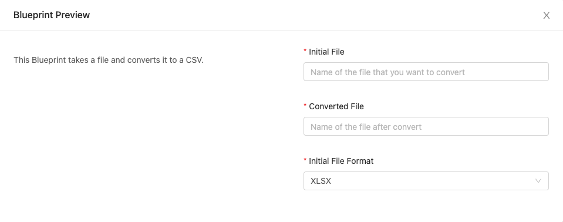
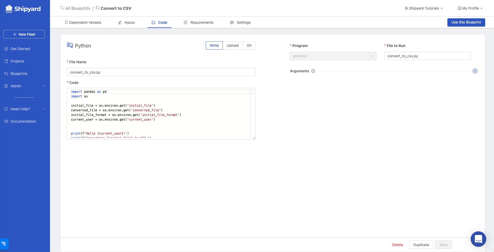
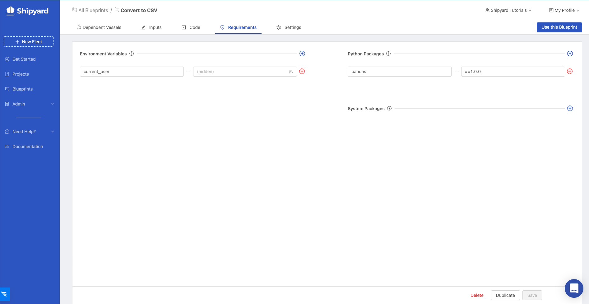
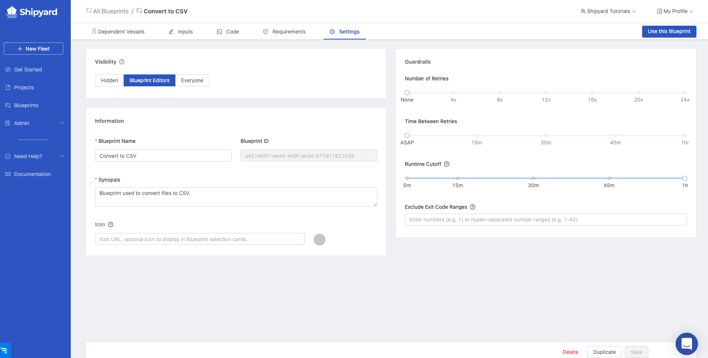
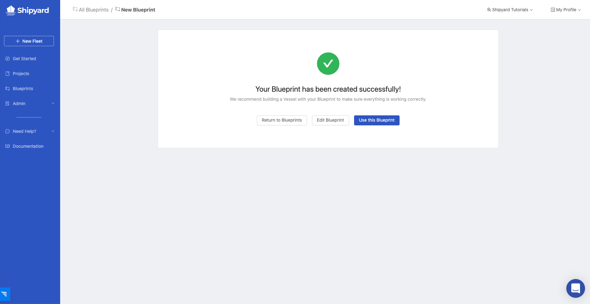

# Create Organizational Blueprint Using Python

## Overview

In this tutorial, you will walk through the steps required to build a custom Blueprint for your organization using Python. By the end of the tutorial, you'll be able to:

- Create a custom [Blueprint](../reference/blueprints/blueprints-overview.md).
- Pass [Blueprint Variables](../reference/blueprints/org-blueprints/blueprint-variables.md) to your solution.
- Pass [environment variables](../reference/environment-variables/environment-variables-overview.md) to your solution.
- Install [package dependencies](../reference/packages/external-package-dependencies.md) for your solution.

## Steps

1. Using the sidebar, click on **Blueprints** to navigate to the Blueprints page.
2. Click the **Add Blueprint** button on the top right of the screen

:::tip success
You've successfully started the setup flow for building a Blueprint.
:::

### Step 1 - Select a Language

Click on the **Python** option. You'll be immediately redirected to the next step.

### Step 2 - Provide Blueprint Variables

1. Click the **plus sign** to add a new Blueprint Variable. This will pop up a menu to input information about the Blueprint Variable.



2. Input the following information:

| Input          | Value                                     |
|----------------|-------------------------------------------|
| Display Name   | Initial File                              |
| Reference Name | initial_file                              |
| Variable Type  | Alphanumeric                              |
| Required?      | Yes                                       |
| Placeholder    | Name of the file that you want to convert |

3. Click **Add Variable**.
4. Click the **plus sign** to add a second Blueprint Variable. Input the following information:

| Input          | Value                             |
|----------------|-----------------------------------|
| Display Name   | Converted File                    |
| Reference Name | converted_file                    |
| Variable Type  | Alphanumeric                      |
| Required?      | Yes                               |
| Placeholder    | Name of the file after converting |

5. Click **Add Variable**.
6. Click the **plus sign** to add a third Blueprint Variable. Input the following information:

| Input          | Value                                                       |
|----------------|-------------------------------------------------------------|
| Display Name   | Initial File Format                                         |
| Reference Name | initial_file_format                                         |
| Variable Type  | Select                                                      |
| Default Value  | XLSX                                                        |
| Required?      | Yes                                                         |
| Placeholder    | File type of the initial file that will be converted to CSV |

7. Before we click Add Variable, we need to add the options that the user will have when selecting. Click the **plus sign** to add the following select options:

| Display Name | Reference Name |
|--------------|----------------|
| XLSX         | xlsx           |
| Parquet      | parquet        |
| TSV          | tsv            |

8. Click **Add Variable**.
9. Under **Blueprint Description**, enter: `This Blueprint takes a file and converts it to a CSV.`
10. Click the **Preview this Blueprint** button to take a look at what a user will see when trying to use this Blueprint.



11. Click **Next Step**.

### Step 3 - Code

1. Under **File Name**, enter `convert_to_csv.py`
2. Under **Code**, enter the following code block: 

```python
import pandas as pd
import os

initial_file = os.environ.get('initial_file')
converted_file = os.environ.get('converted_file')
initial_file_format = os.environ.get('initial_file_format')
current_user = os.environ.get('current_user')


print(f'Hello {current_user}!')
print(f'Converting {initial_file} to CSV.')
if initial_file_format == 'xlsx':
    xlsx_dataframe = pd.read_excel(initial_file)
    xlsx_dataframe.to_csv(converted_file)
elif initial_file_format == 'parquet':
    parquet_dataframe = pd.read_parquet(initial_file, engine="fastparquet")
    parquet_dataframe.to_csv(converted_file)
elif initial_file_format == 'tsv':
    tsv_dataframe = pd.read_csv(initial_file, sep='\t')
    tsv_dataframe.to_csv(converted_file)
print(f'{converted_file} is ready to use!')
```

3. Under **File to Run**, enter `convert_to_csv.py`



4. Click **Next Step**.

### Step 4 - Requirements

1. Click the **plus sign** to add an Enivronment Variable.
2. For the **name**, enter `current_user`.
3. For the **hidden value**, enter the name of everyone's favorite pirate: Jack_Sparrow.
4. Click the **plus sign** next to Python Packages to add a package. 
5. Enter `pandas` for the name and `==1.0.0` for the version.
6. Click **Next Step**.



### Step 5 - Settings

1. Under **Blueprint Name**, enter `Convert to CSV`.
2. Under **Synopsis**, enter the following: Blueprint used to convert files to CSV.



3. Click **Save & Finish**. This will redirect you to a page that tells you that your Blueprint has been created successfully.



:::tip Success
You've successfully created a Blueprint for your organization!
:::