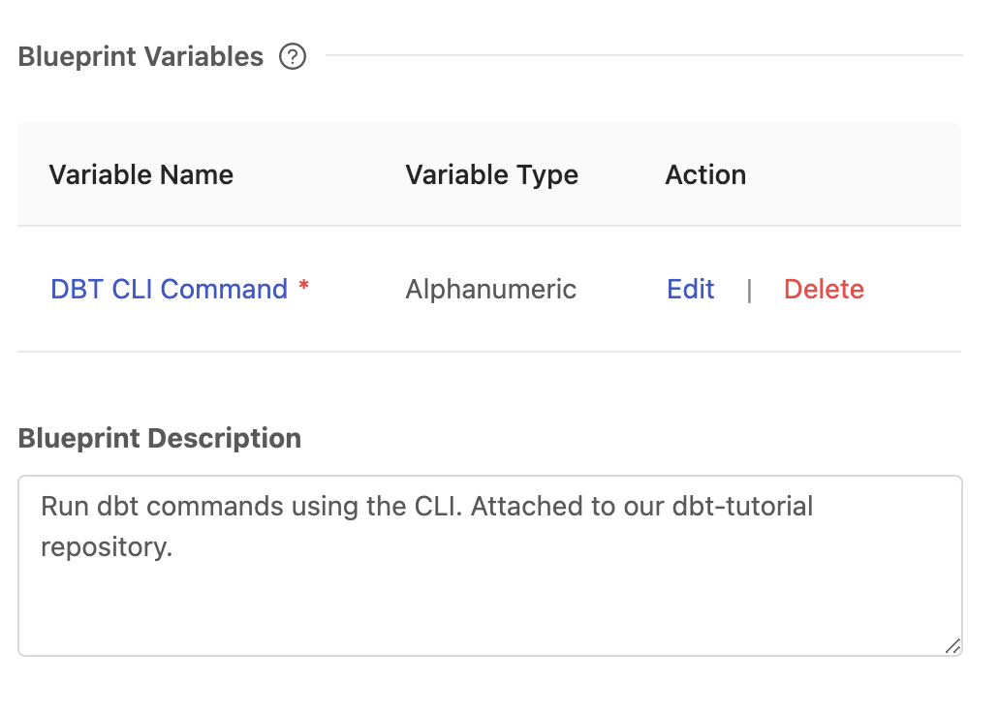
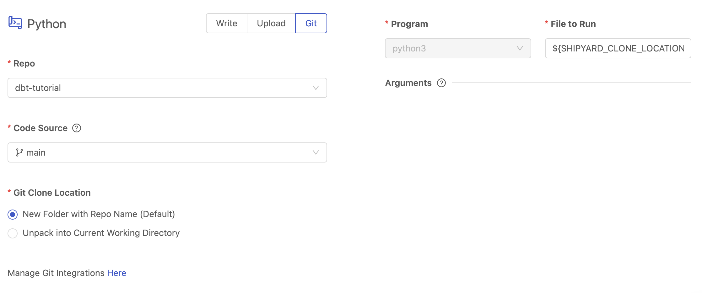
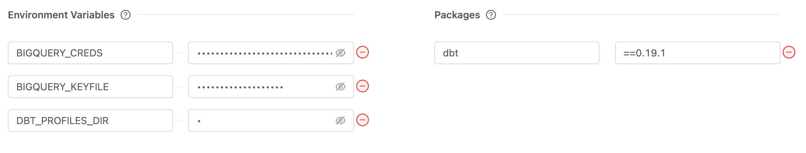
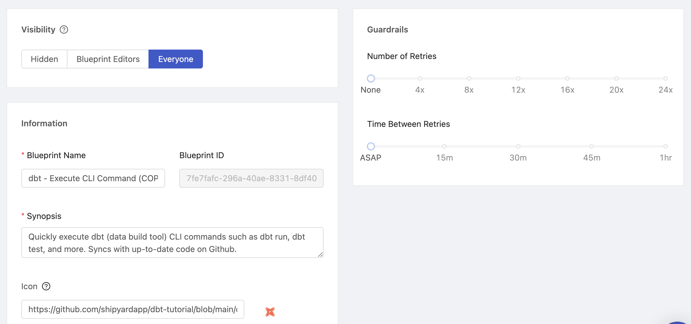
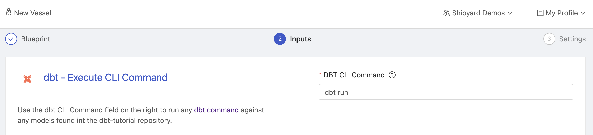
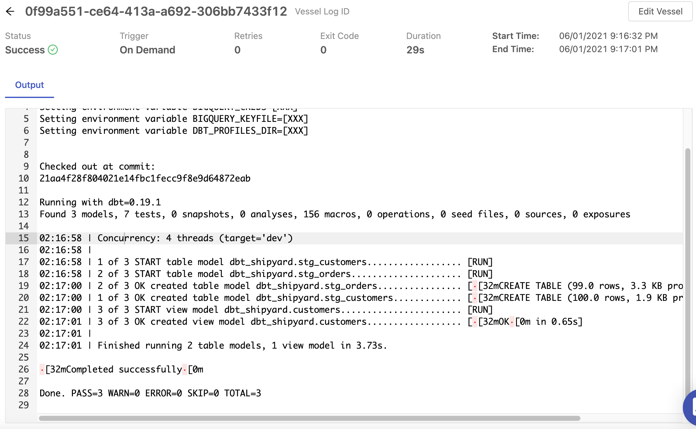

# Building a Blueprint with dbt (Data Build Tool)

## Overview

In this tutorial, you'll walk through the steps required to set up dbt to run in the cloud, on Shipyard. We will be creating a Blueprint that can be re-used by multiple team members and updated in the background. This tutorial is only in Python.

By the end of the tutorial, you'll be able to:

- Set up a Blueprint using Python
- Successfully run dbt on Shipyard
- Share data models with your organization
- Run multiple instances of dbt simultaneously
- Integrate a data model into your Fleets

With this tutorial, it is assumed that:
- You have already set up an integration with Github.
- You are running this tutorial for the first time using the contents of the [jaffle-shop tutorial](https://docs.getdbt.com/tutorial/setting-up) or a repository with your own model definitions.

If you need to reference an example dbt setup, you can view the code at our [dbt-tutorial repository](https://github.com/shipyardapp/dbt-tutorial).

For more information, read [our blog post](https://www.shipyardapp.com/blog/deploying-dbt-in-the-cloud/) that covers Getting Started with dbt. You can also visit [www.getdbt.com](https://www.getdbt.com) for additional information.

## Setup

1. Add [this script](https://github.com/shipyardapp/dbt-tutorial/blob/main/execute_dbt.py) to the root directory of the GitHub repository where your dbt models live, with the file name of `execute_dbt.py`.
2. Move your `profiles.yml` file to the root directory of the GitHub repository where your dbt models live.

## Steps

1. Click **Blueprints** on the side navigation bar.
2. Click the **Add Blueprint** button in the top right.

### Step 1 - Select A Language

Click on **Python**. You'll be immediately redirected to the next step.

### Step 2 - Create Blueprint Variables

Click the **+** icon to create a new Blueprint variable. You should see a screen that looks like this:

Our code for dbt has only 1 variables that we expect to receive. For a detailed overview of each of these fields, read more about [Blueprint Variables](../reference/inputs/blueprint-variables.md).

#### DBT CLI Command

1. Set the Display Name to `DBT CLI Command`
2. Set the Reference Name to `DBT_COMMAND`
3. Leave the Variable Type set to Alphanumeric.
4. Set the Default Value to `dbt run`.
5. Check the box for Required?
6. Leave the placeholder empty.
7. Set the Tooltip to `Enter the CLI command you'd like to run. Supports running multiple commands successively with &&`
8. Click **Add Variable**.

Give your Blueprint a Description that will help others in your team understand what dbt code is being accesed.

At this point, your screen should look something like this. 

Click **Preview this Blueprint** to verify how everything will look and feel to a user. 

Once you've verified that everything is set up correctly, go ahead and click **Next Step**.

### Step 3 - Provide Your Code

1. Click the Git section of the page.
2. Select your dbt repository from the dropdown. Ours is named `dbt-tutorial`
3. Select the branch or tag that you want to `git checkout` at runtime. Ours is named `main`.
4. Keep the Git Clone Location as New Folder with Repo Name (default) 
5. On the right-hand side of the screen, enter `${SHIPYARD_CLONE_LOCATION}/execute_dbt.py` into the File to Run field.

Once these steps are complete, your screen should look exactly like this.

Once you've verified that everything has been set up correctly, click **Next Step** in the bottom right.

### Step 4 - Requirements

#### Environment Variables

1. Click the **+** icon next to Environment Variables 3x to add three new variables.
2. Set the first variable's Name to `BIGQUERY_CREDS` and Value to your json credentials.
3. Set the second variable's Name to `BIGQUERY_KEYFILE` and Value to `bigquery_creds.json`.
4. Set the thrid variable's Name to `DBT_PROFILES_DIR`  and Value to `.`

:::note
The value field will always show `•••••••` as you type. This is because Environment Variables are commonly used for passwords and secrets. You can always reveal what you've written by clicking the eye icon. 
:::

#### Packages

1. Click the **+** icon next to Packages.
2. Set the first Package Name to `dbt` and the version to `==0.19.1`

Your screen should look similar to this:

Once you're done, go ahead and click the **Next Step** button at the bottom of the screen.

### Step 5 - Settings

1. Under the State section, select **Everyone**.
2. Under the Information section:
   1. Give your Blueprint the name of `dbt Tutorial Run`.
   2. Give your Blueprint the Synopsis of `Quickly execute dbt (data build tool) CLI commands such as dbt run, dbt test, and more. Syncs with up-to-date code on Github.`
3. Set the Icon to `https://github.com/shipyardapp/dbt-tutorial/blob/main/dbt.png?raw=true`
4. Leave the Guardrails section defaults of None and ASAP.

Your Blueprint should look like this:

5. Click the **Save & Finish** button at the bottom of the screen.

:::success
You've successfully set up dbt as a Blueprint.
:::

Now anyone in your organization can use the Blueprint to run your data models. We're going to test our Blueprint to validate that everything runs correctly.

### Step 6 - Setting Up a Vessel

1. Click **Use this Blueprint** on the success screen.

At this point, you should be on a screen that looks like this:

1. Enter `dbt run` into the DBT CLI Command field.
2. Click **Next Step**.
3. On the Settings step:
   1. Name your Vessel `dbt run test`
   2. Select either *Playground* or *Testing* for the Project
   3. Click **Save & Finish**
4. Immediately Click **Run Your Vessel**

### Step 7 - Review the Results

You should be immediately redirected to the actively running Vessel Log. Within the Log you'll be able to see all of the dbt models and their output for the sample data.

You should also be able to see the resulting tables and views in your database of choice.

Congratulations on setting up a dbt Blueprint! You now have a repeatable solution that can be used again and again for all of your data models.

## What Comes Next

Now that you've successfully worked your way through this tutorial, there's a lot of additional things that you can try out on your own with this knowledge.

### Run Different Commands

Can you set up new Vessels with the same Blueprints

### Set up Triggers

dbt works best when it's running on a consistent schedule or immediately after new data has loaded. Try adding [Triggers](../reference/triggers/triggers-overview.md) to your dbt Vessels or including them as part of a [Fleet](../reference/fleets.md).

### Upload Logs

Every time you run dbt, a log file is either created or updated. This works great when you're running dbt locally, but not as great on Shipyard where the default behavior is to wipe any generated files after runtime.

Try to set up a Fleet that uploads the generated `dbt.log` file in `/logs/` to your Cloud storage platform of choice.
