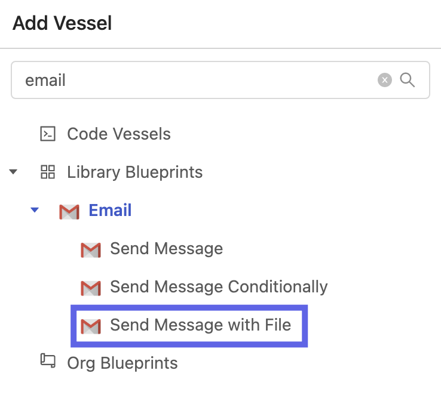

# Duplicating a Fleet with the YAML Editor

## Overview

In this tutorial, you'll walk through the steps to duplicate a fleet using Shipyard's [YAML Editor](../reference/fleets/yaml-editor.md). 

By the end of this tutorial, you'll be able to: 

- Create a Fleet with the YAML Editor
- Duplicate Fleets 

For more information about our YAML Editor, check out this [blog post](https://www.shipyardapp.com/blog/facilitating-workflow-as-code/) that covers the basics of using the YAML Editor.

## Steps

### Create Initial Fleet

:::note 
We are going to be using the Fleet created in our Getting Started tutorial. If you went through that tutorial, feel free to skip this section and navigate to that Fleet. 
:::

1. On the top left of your Shipyard screen, click the **New Fleet** button
2. This will pop up a prompt asking you to select a Project. Select the **Playground** Project. Click **Select Project**.

3. Navigate down to the **HTTP** dropdown and click it. It will expand the Blueprints that are available to use for HTTP. 
   
   

4. Click the Vessel named **Download File from URL**. This creates a New Vessel and immediately opens the edit pane for that Vessel on the left side of the screen.

    

5. In the **Vessel Name** field, remove the automatically generated name and type **Download Slinky Dog Dash Ride Data**. 
6. In the **File URL** field type `https://cdn.touringplans.com/datasets/slinky_dog.csv`
7. In the **File Name** field type `slinky_dog_dash.csv`
8. In the **Folder Name** field type `disney_world_wait_times`

9.  Click the `+` icon in the sidebar to add another Vessel to the Fleet.
10.  Search for **email** using the search bar at the top. Click on **Send Message with File**

11. In the **Vessel Name** field, remove the automatically generated name and type **Send Slinky Dog Dash Data via Email**.
12. Fill out fields with the following values:

| Name | Value |
|:---|:---|
| Send Method | TLS |
| SMTP Host | smtp.gmail.com|
| SMTP Port |587 |
| Username | Leave blank and use the default |
| Password | Leave blank and use the default |
| Sender Address | Leave blank and use the default |
| Sender Name | |
| TO | YOUR EMAIL HERE |
| CC | |
| BCC | |
| Subject | Slinky Dog Dash Wait Times |
| Message | Here's the most recent wait times for Slinky Dog Dash! |
| File Name Match Type | Exact Match|
| File Name | slinky_dog_dash.csv |
| Folder Name | disney_world_wait_times |
| Include Shipyard Footer? | ✅|

13. Click and drag from a circle on the **Download Slinky Dog Dash Ride Data** Vessel towards a circle on the **Send Slinky Dog Dash Data via Email** Vessel. 

14. Click the gear icon on the side of the Fleet Builder to access Fleet Settings.
15. Under Fleet Name, enter `Download Slinky Dog Dash Ride Data`.

16. Click **Save and Finish** on the bottom right corner of your screen. This will take you to a screen letting you know that the Fleet was created successfully. 
17. Click **Return to Project**. 
18. Click on your Download Slinky dog Dash Ride Data Fleet. 
19. Click the **Fleet Builder** button to open the Fleet Builder.

### Copy Initial Fleet's YAML

1. Click on the **Use YAML Editor** button.

You should now be able to see the YAML code for the fleet we created:

2. Copy the YAML code.

### Create New Fleet with YAML Editor

1. Click **New Fleet** in the top left corner of the Shipyard webpage.
2. Choose the **Playground** project. Click **Select Project**.

3. Click the **Use YAML Editor** button.
4. Delete the YAML code that is currently in the editor and paste the code from the previous fleet.

### Use YAML Editor to Edit Fleet

1. For name, change `Download Slinky Dog Dash Ride Data` to `Download Space Mountain Ride Data`.
2. Under vessels, change `Download Slinky Dog Dash Ride Data` to `Download Space Mountain Ride Data`
3. Under inputs,
   1. Change HTTP_DESTINATION_FILE_NAME to `space_mountain.csv`
   2. Change HTTP_FILE_URL to `https://cdn.touringplans.com/datasets/space_mountain.csv`

4. Change the second Vessels name from `Send Slinky Dog Dash Data via Email` to `Send Space Mountain Data via Email`
5. Change the following inputs for that Vessel:
   1. EMAIL_MESSAGE: Here's the most recent wait times for Space Mountain!
   2. EMAIL_SOURCE_FILE_NAME: space_mountain.csv
   3. EMAIL_SUBJECT: Space Mountain Wait Times

6. Under Connections, change the names of the two vessels to match our new vessels:
   1. Download Slinky Dog Dash Ride Data -> Download Space Mountain Ride Data
   2. Send Slinky Dog Dash Data via Email -> Send Space Mountain Data via Email

7. Click **Save & Finish**.

