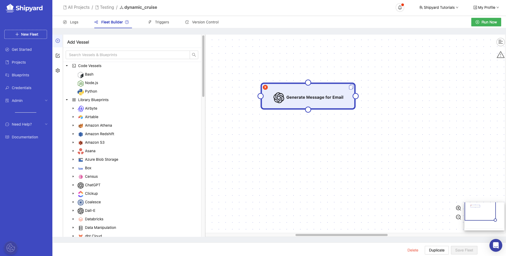
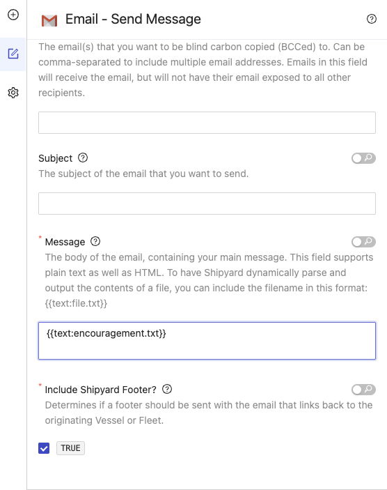

# Embed a Text File into a Message Body

## Overview

In this tutorial, you'll walk through the steps to embed the contents of a text file into the message of an email.

## Setup

This tutorial assumes that you have a text file in Shipyard ready to be embed into an email message. There are a few ways to get a text file into Shipyard:

- Download the file from a cloud storage container such as Amazon S3 or Google Drive
- Generate a text file using a script.
- Generate a text file using a ChatGPT or Whisper Blueprint.

Once you have a Vessel in your Fleet to have a text file, you are ready to get started.

## Steps

1. Add a Vessel to your Fleet with the Email - Send Message Blueprint.

2. Use the credential management system to fill in your email credentials. 
3. Under **Sender Address**, enter your email address.
4. Under **To**, enter the email address where you want this message to go. 
5. Under **Message**, enter `{{text:file.txt}}`. Replace **file.txt** with your text file name from your first Vessel.

6. Connect your first Vessel to the email Vessel.
7. Click **Save Fleet**.

:::tip Success
You've successfully embedded the contents of a text file into the message of an email.
:::

