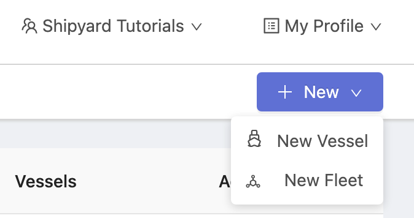
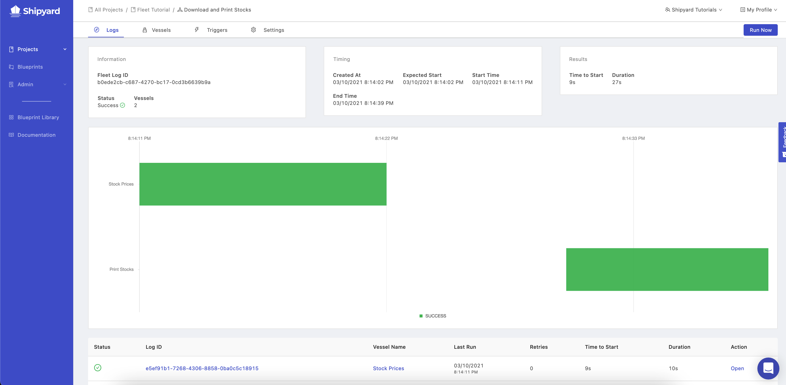
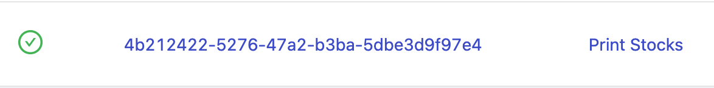
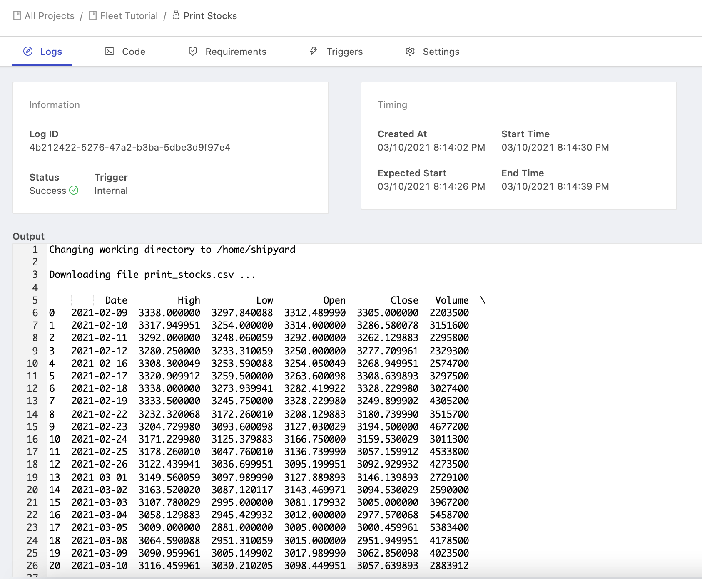

# Building Your First Fleet that Shares Files

## Overview

In this tutorial, you'll walk through the steps required to set up a very simple Fleet that contains two Vessels.

* A vessel that generates a CSV file containing stock data
* A Vessel that reads the contents of the CSV file and prints the output. 

By the end of the tutorial, you will know how to:

* Set up a Vessel with Code
* Write a script directly in the UI
* Connect Vessels together as part of a Fleet
* Use a Fleet to access files created upstream

:::caution
For the sake of this tutorial, we suggest starting off by building a Vessel inside of the Project called *Playground* or *Testing*. You can follow [this tutorial](first-project.md) to set that up.
:::

## Steps

### Step 1 - Building a Vessel to Generate a CSV

1. Using the sidebar, click on **Projects** to expand the list of projects.
2. Click on either the **Playground** project or the **Testing** project. You'll be directed to the Vessels tab for that project.
3. Hover over the **+ New** button in the top-right corner of the screen and select **New Vessel**.


4. A modal will pop up asking you how you would like to build your Vessel. On the left side of the modal, you'll see an option for a **With Code**. Click this option.


5. Select **Python** as your Language.


7. In the **File Name** field type `stocks.py`

8. In the Code field, copy and paste the following code. Once finished, click **Next Step** at the bottom.

```python title="stocks.py"
# Import external packages
import pandas_datareader as web
import datetime
 
# Set key variables
today = datetime.date.today()  
start = today - datetime.timedelta(days=30)
end = today
stock = 'AMZN'
file_name = 'stock_prices.csv'

# Create stock price dataframe
df = web.DataReader(stock, 'yahoo', start, end)
 
 # Create CSV with stock prices
df.to_csv(file_name)
print(f'{file_name} was successfully created.')
```

This code pulls down the last 30 days of stock data for Amazon and creates a file named `stock_prices.csv`.  
  
9.  On the Requirements tab, add in `pandas_datareader` as a package. Once finished click **Next Step**.


10. Give your Vessel a name of `Stock Prices` and click **Save & Finish**. 

11. Click **Run your Vessel** to view the output**.** If you set everything up successfully, you should see a page that looks similar to this with an output message of `stock_prices.csv was successfully created.`


### Step 2 - Building a Vessel to Print the contents of the CSV

1. Repeat instructions 1-5 on Step 1 to begin setting up a new Vessel using Python.

2. In the **File Name** field type `print_stocks.py`

3. In the Code field, copy and paste the following code. Once finished click **Next Step**.

```python title="print_stocks.py"
import pandas as pd

# Set key variables
file_name = 'stock_prices.csv'

# Set better print options
pd.set_option('display.max_columns', None)
pd.set_option('display.max_rows', None)
pd.set_option('display.max_colwidth', None)

# Import the CSV created in the previous step as a dataframe
df = pd.read_csv(file_name)

# Print the dataframe
print(df)
```

This code imports a CSV file name that you specify, in this case `stock_prices.csv` and prints the contents of the file in full.   

4. On the Requirements tab, add in `pandas` as a package and `==1.2.3` as the version. Once finished click **Next Step**.


5. Give your Vessel a name of `Print Stocks` and click **Save & Finish**. 

6. Click **Run your Vessel** to view the output**. This Vessel should error out** because it's trying to read the contents of a file, `stock_prices.csv`, that doesn't currently exist. This result is expected.   
  
In order to make this Vessel run successfully, we need to create a Fleet that connects it to our first Vessel, `Stock Prices`, which creates the file we want to print. 

### Step 3 - Creating the Fleet

1. Navigate back to the playground project. 
2. Hover over the **+ New** button and click **New Fleet.**



3. On the Fleets page, click into the empty white canvas area to open up a Vessel selection box. 

Select the **Stock Prices** Vessel to add it to the fleet. Repeat the process for the **Print Stocks** Vessel.

4. Hover over the **Stock Prices** Vessel to reveal purple circles. Drag from one of these circles to the **Print Stocks** Vessel and release. This should have connected the two Vessel together with an arrow that says **Success.**  
  
The editor shows that after **Stock Prices** runs successfully, it will immediately trigger **Print Stocks**. 


Once you've connected the Vessels together, click **Next Step**.

5. Name your Fleet `Download and Print Stocks` then click **Save and Finish**.

6. You should see the following success screen.


### Step 4 - Run the Fleet

1. Click **Run your Fleet** on the success confirmation screen**.** 

2. You'll be redirected to a Fleet Log page as your Fleet runs. This page will refresh automatically as the Fleet runs. Wait until you see both Vessels as green bars, indicating that they completed successfully.



3. Click on the Log ID for the **Print Stocks** Vessel. Your Log ID will be different than the one shown below.



4. In the output, you should now see the Stock data printed out! 



:::tip success
You've successfully created and verified a Fleet that shares files!
:::

## Further Experimentation

Now that you've got the basics down, experiment on your own with a few changes to make sure you understand how Fleets allow Vessels to share files. Some suggestions to get you started:

1. Create an intermediary Vessel that renames the file after **Stock Prices** and before **Print Stocks**. How will you need to adjust things to ensure that **Print Stocks** run successfully? How about if you create the file in a directory? 
2. Change the **Stock Prices** Vessel to generate a few different files for different stock tickers. How will you need to adjust **Print Stocks** to access all of these files? How can you combine the files into one? 
3. Create a Vessel using a Blueprint from the [Blueprint Library](../reference/blueprint-library/blueprint-library.md) that uploads the file to your storage solution of choice \(S3, Google Cloud Storage, Dropbox, etc.\). Can you successfully get the file delivered to your own storage solution? 
4. Create an intermediary Bash Vessel to list all of the files available to the fleet \(using `ls -a -R`\). What files are available to the Fleet at the beginning of the Fleet? What files are available to the Fleet at the end of the Fleet?


