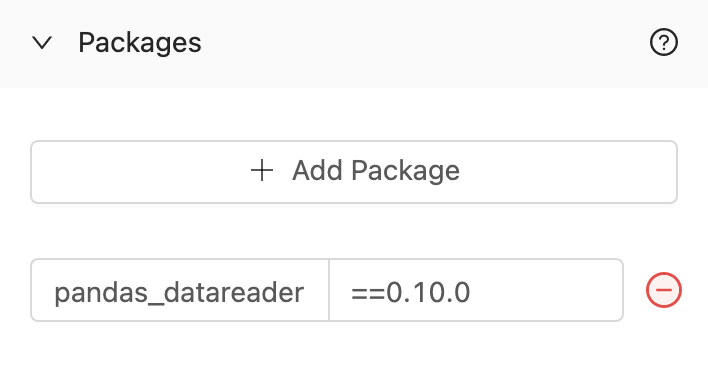

# Building Your First Fleet that Shares Files

## Overview

In this tutorial, you'll walk through the steps required to set up a very simple Fleet that contains two Vessels.

* A Vessel, built with Code, that generates a CSV file containing stock data and prints the output.
* A Vessel, built with a Blueprint, that emails the contents of the CSV file. 

By the end of the tutorial, you will know how to:

* Set up a Vessel with Code
* Set up a Vessel with a Blueprint
* Write a script directly in the UI
* Connect Vessels together as part of a Fleet
* Use a Fleet to access files created upstream

:::caution
For the sake of this tutorial, we suggest starting off by building a Vessel inside of the Project called *Playground* or *Testing*. You can follow [this tutorial](first-project.md) to set that up.
:::

## Step 1 - Accessing the Fleet Builder

1. Using the sidebar, click on **Projects** to navigate to the list of all projects.
2. Click on either the **Playground** project or the **Testing** project. You'll be directed to the Vessels tab for that project.
3. Hover over the **+ New** button in the top-right corner of the screen and select **New Fleet**. This will redirect you to the Fleet builder page. 


## Step 2 - Building a Vessel to Generate a CSV

1. Click **Python** from the list of options on the sidebar. 


This creates a New Vessel and immediately opens the edit pane for that Vessel on the left side of the screen.


2. In the **Vessel Name** field, remove the automatically generated name and type **Download Stock Data**. 

3. In the **File to Run** field type `stocks.py`

4. In the Code field, copy and paste the following code. Once finished, click **Next Step** at the bottom.

```python title="stocks.py"
# Import external packages
import pandas_datareader as web
import pandas as pd
import datetime
import os
 
# Set key variables
today = datetime.date.today()  
start = today - datetime.timedelta(days=180)
end = today
stock = os.environ.get('STOCK','AMZN')
file_name = 'stock_prices.csv'

# Create stock price dataframe
df = web.DataReader(stock, 'yahoo', start, end)

# Set better print options
pd.set_option('display.max_columns', None)
pd.set_option('display.max_rows', None)
pd.set_option('display.max_colwidth', None)
 
 # Create CSV with stock prices
df.to_csv(file_name)
print(f'{file_name} was successfully created.')

# Print the contents of the generated dataframe.
print(df)
```

This code pulls down the last 30 days of stock data for any stock of your choosing (defaults to AMZN), creates a file named `stock_prices.csv` and prints the contents to standard output.  

1. Click on the **Environment Variables** panel and click **Add Environment Variable**.
   
2.  Set the name to `STOCK` and the value to any single US Stock Ticker. We recommend something like `GOOG` , `AMZN` or `AAPL`.


7.  Click on the **Packages** panel and click the **Add Package** button twice.
8.  Set the name of the first package to  `pandas_datareader` and the version to `==0.10.0`.
9.  Set the name of the second package to `pandas` without a version.



:::note Pro-Tip
When specifying external packages, not including a version is the equivelant of saying "Always install the latest package".
:::

## Step 3 - Building a Vessel to Email the CSV

1. Click the `+` icon in the sidebar to add another Vessel to the Fleet.


2. Search for **email** using the search bar at the top. Click on **Send Message with File**


3. In the **Vessel Name** field, remove the automatically generated name and type **Send Stock Data via Email**.
4. Fill out fields with the following values:

| Name | Value |
|:---|:---|
| Send Method | TLS |
| SMTP Host | smtp.gmail.com|
| SMTP Port |587 |
| Username | Leave blank and use the default |
| Password | Leave blank and use the default |
| Sender Address | Leave blank and use the default |
| Sender Name | |
| TO | YOUR EMAIL HERE |
| CC | |
| BCC | |
| Subject | Stock Data |
| Message | Here's the most recent stock data! |
| File Name Match Type | Exact Match|
| File Name | stock_prices.csv |
| Folder Name | |
| Include Shipyard Footer? | ✅|

## Step 4 - Finalizing the Fleet

1. Click and drag from a circle on the **Download Stock Data** Vessel towards a circle on the **Send Stock Data via Email** Vessel. 


This will connect the two Vessels, allowing one to be triggered by the other. Additionally, this allows files created upstream (Download Stock Data) to be accessed by the Vessel that lives downstream (Send Stock Data via Email).

2. Select the cog icon on the sidebar to open up Fleet settings.


3. In the **Fleet Name** field, remove the automatically generated name and type **Generate and Send Stocks**.


:::note
By default, every Fleet and every Vessel you create will send error notifications to your email. You can always update this as needed.
:::

4. Click the **Save and Finish** button at the bottom.

5. You should see the following success screen.


## Step 5 - Running the Fleet On Demand

1. Click **Run your Fleet** on the success confirmation screen.

2. You'll be redirected to a Fleet Log page as your Fleet runs. This page will refresh automatically as the Fleet runs. Wait until you see both Vessels as green bars, indicating that they completed successfully.

3. Click on the Log ID or the bar graph for the **Download Stock Data** Vessel. Your Log ID will be different than the one shown below.


4. In the output, you should now see the Stock data printed out! 


5. Go check your email. You should also see a message that contains the stock data.


:::tip success
You've successfully created and verified a Fleet that shares files between a Vessel built with Code and a Vessel build with a Blueprint!
:::

## Further Experimentation

Now that you've got the basics down, experiment on your own with a few changes to make sure you understand how Fleets allow Vessels to share files. Some suggestions to get you started:

1. Create an intermediary Vessel that renames the file after **Download Stock Data** and before **Send Stock Data via Email**. How will you need to adjust things to ensure that **Send Stock Data via Email** run successfully? How about if you create the file in a directory? 
2. Change the **Download Stock Data** Vessel to loop through multiple stock tickers.
3. Create a Vessel using a Blueprint from the [Blueprint Library](../reference/blueprint-library/blueprint-library-overview.md) that uploads the file to your storage solution of choice \(S3, Google Cloud Storage, Dropbox, etc.\) at the same time the email delivers. Can you successfully get the file delivered to your own storage solution?
