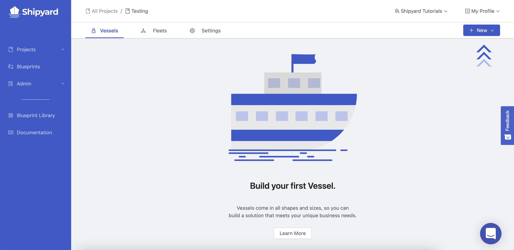

# Building Your First Project for Testing

## Overview

For the sake of all of our tutorials, we suggest creating a new project specifically for testing. This will serve as an area for you to freely explore the functionality of Shipyard without the fear of affecting anything else in the platform.

## Creating your Testing Project

1. Using the navigation on the left-side of the screen, click on **Projects**. This will cause the navigation menu to expand.

2. Click on **View All Projects**. This will take you to the All Projects page.

   If this is your first time in the platform, you should only see a project called *Playground*. 

   

3. Click the **New Project** button in the top-right corner of the screen.

   

4. Give your project a name of *Testing*.
5. In the timezone field, start typing `Central` .
6. Select the *US/Central* time zone by clicking the name.

:::note
Feel free to search for and select your own time zone instead.
:::

Your setup should look like this:

7. Click the **Create** button in the bottom-right corner of the screen.

:::tip success
You've now successfully created your first project named Testing.
:::

After creating a project, you'll be immediately redirected into it. You should see the following screen which directs you to create your first Vessel.

