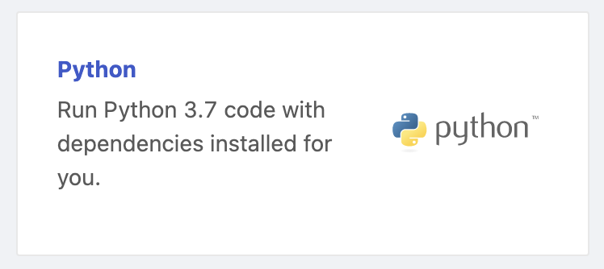
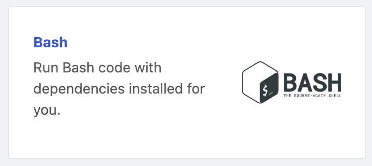
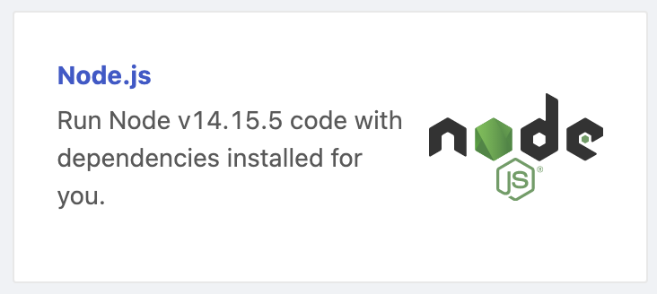
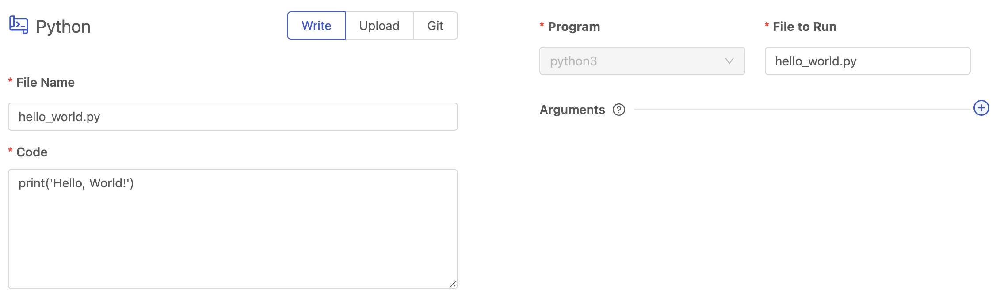
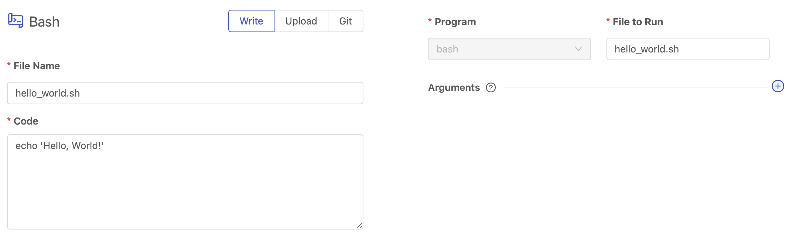
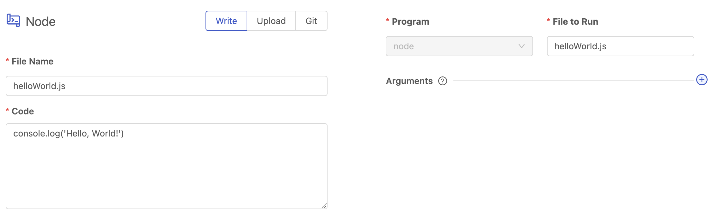
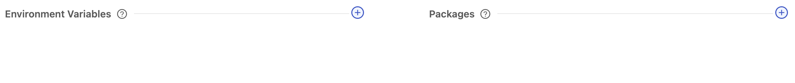
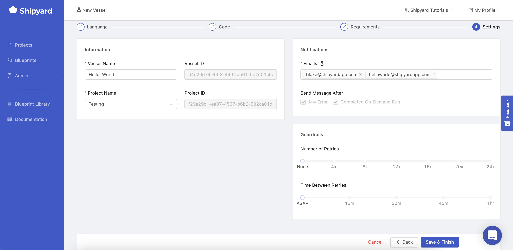
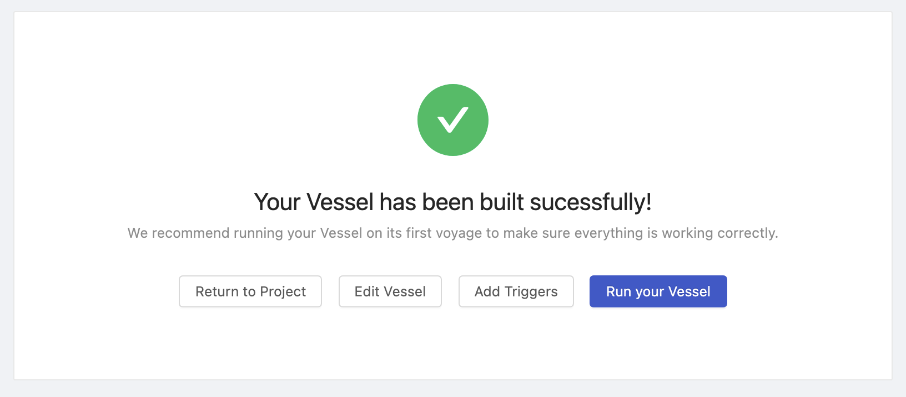
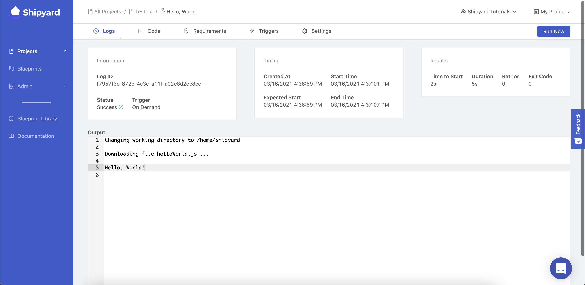

import Tabs from '@theme/Tabs';
import TabItem from '@theme/TabItem';

# Building your First Vessel with Code - Hello World

## Overview

In this tutorial, you'll walk through the steps required to set up a very simple Vessel that prints `Hello, World`. By the end of the tutorial, you will know how to:

- Set up a Vessel with Code.
- Write a script directly in the UI.
- Check to verify that a Vessel ran successfully.

:::caution
For the sake of the this tutorial, we suggest starting off by building a Vessel inside of the *Playground* Project or a project for *Testing*. You can follow [**this tutorial** ](first-project.md)to set that up.
:::

## Steps

### Step 1 - Initial Setup

1. Using the sidebar, click on **Projects** to expand the list of projects.
2. Click on either the *Playground* project or the *Testing* project. You'll be directed to the Vessels tab of this project.
3.  Hover over the **+ New** button in the top-right corner of the screen and click **New Vessel**.

4. A modal will pop up asking you how you would like to use to build your Vessel. On the left side of the modal, you'll see an option for a **With Code**. Click this option.

:::success
You've successfully started the setup flow for building a Vessel with Code!
:::

We'll now walk through the Vessel Wizard to create our *Hello World* Vessel. Select the tab of **Python**, **Bash**, or **Node** to get language specific instructions.

### Step 2 - Select a Language

<Tabs
groupId="languages"
defaultValue="python"
values={[
{label: 'Python', value: 'python'},
{label: 'Bash', value: 'bash'},
{label: 'Node', value: 'node'},
]}>
<TabItem value="python">

Click on **Python**. You'll be immediately redirected to the next step.

</TabItem>

<TabItem value="bash">

Click on **Bash**. You'll be immediately redirected to the next step.

</TabItem>
<TabItem value='node'>

Click on **Node.js**. You'll be immediately redirected to the next step.

</TabItem>
</Tabs>

### Step 3 - Provide your Code

By default, you will be able to start providing your code via the [Write method](../reference/code/write-code.md).

<Tabs
groupId="languages"
defaultValue="python"
values={[
{label: 'Python', value: 'python'},
{label: 'Bash', value: 'bash'},
{label: 'Node', value: 'node'},
]}>
<TabItem value="python">

1. In the field entitled **File Name** write `hello_world.py` . This is now the name of your script.
2. In the field titled **Code** write `print('Hello, World!')` . Your script `hello_world.py` now contains the Python code to print this famous message.
3. On the right-hand side of the screen, there is a field entitled **File to Run**. Because the Code section was set to write, this field will automatically mirror what you typed into **File Name**. It should say `hello_world.py`.
4. Click the **Next Step** button at the bottom of the screen.

</TabItem>

<TabItem value="bash">

1. In the field entitled **File Name** write `hello_world.sh` . This is now the name of your script.
2. In the field titled **Code** write `echo 'Hello, World!'` . Your script `hello_world.sh` now contains the shell command to print this famous message.
3. On the right-hand side of the screen, there is a field entitled **File to Run**. Because the Code section was set to write, this field will automatically mirror what you typed into **File Name**. It should say `hello_world.sh`.
4. Click the **Next Step** button at the bottom of the screen.

</TabItem>
<TabItem value='node'>

1. In the field entitled **File Name** write `helloWorld.js` . This is now the name of your script.
2. In the field titled **Code** write `console.log('Hello, World!')` . Your script `helloWorld.js` now contains the Node.js code to print this famous message.
3. On the right-hand side of the screen, there is a field entitled **File to Run**. Because the Code section was set to write, this field will automatically mirror what you typed into **File Name**. It should say `helloWorld.js`.
4. Click the **Next Step** button at the bottom of the screen.
  

</TabItem>
</Tabs>

### Step 4 - Requirements

For this tutorial, we don't have any [environment variables](../reference/requirements/environment-variables.md) to set up or [external package dependencies](../reference/requirements/external-package-dependencies.md) to install. Go ahead and click the **Next Step** button at the bottom of the screen.

### Step 5 - Settings

1. Under the information section, give your Vessel the name of `Hello, World`.
2. Under the notifications section, make sure that your email is listed. It should be added by default.
3. Add an additional notification email of `helloworld@shipyardapp.com`. You'll notice that you can add any user or alias to the notification list, whether or not they have access to your organization.
4. Click the **Save & Finish** button at the bottom of the screen.

:::note
Not every step will be required. The necessary settings depend entirely on the solution you build and it's complexity.
:::

### Step 6 - Running the Vessel

You should see the following screen:

Go ahead and click **Run Your Vessel**. This will schedule your Vessel to run immediately and redirect you to [Vessel Log](../reference/logs/vessel-logs.md) page.

### Step 7 - Checking the Logs

You should have been redirected to the following page that shows you all of the details about the specific Log you clicked.

:::note
If the Vessel has a Status of **Scheduled** or **Running** you may see sections of this page that are incomplete.

Wait a few seconds for your Vessel to begin running. The page will automatically refresh with updates.
:::

In the output, you'll see a total of 3 things.

1. Shipyard creates a working directory under `/home/shipyard/`
2. Shipyard downloads the file you created under the [Code](../reference/code/code-overview.md) section.
3. Shipyard prints the text `Hello, World!`

:::success
You've successfully created and run a Vessel!
:::

Now that you've completed the basics of building a Vessel, try out the next tutorial!
