import Tabs from '@theme/Tabs';
import TabItem from '@theme/TabItem';

# Building a Vessel with Code from GitHub

## Overview

In this tutorial, you'll walk through the steps required to set up a Vessel that runs a Python script from GitHub.


By the end of the tutorial, you'll be able to:

- Connect your GitHub account to Shipyard.
- Create a [Vessel](../reference/vessels.md) with a script from GitHub.
- Install [package dependencies](../reference/packages/external-package-dependencies.md) for your solution.
- Check [Logs](../reference/logs/logs-overview.md) to verify that your Fleet ran successfully.

## Setup

We will be picking up with the Fleet that was created in our Getting Started Tutorial: [Building Your First Fleet with Low-Code Library Blueprints](../getting-started/first-fleet.md). If you'd like to follow along, you can work through the first two installments of the Getting Started Tutorial Series or you can [create a starting point](create-fleets-with-yaml.md) with this YAML code: 


```yaml [](edited-with-Axolo)
name: Download File from Webpage and Email to User
vessels:
    Download Slinky Dog Dash Ride Data:
        source:
            blueprint: HTTP - Download File from URL
            inputs:
                HTTP_CUSTOM_HEADERS: null
                HTTP_DESTINATION_FILE_NAME: slinky_dog_dash.csv
                HTTP_DESTINATION_FOLDER_NAME: disney_world_wait_times
                HTTP_FILE_URL: https://cdn.touringplans.com/datasets/slinky_dog.csv
            type: BLUEPRINT
        guardrails:
            retry_count: 1
            retry_wait: 0s
            runtime_cutoff: 4h0m0s
        notifications:
            emails:
                - YOUR_EMAIL_HERE
            after_error: true
            after_on_demand: false
    Email Slinky Dog Dash Ride Data:
        source:
            blueprint: Email - Send Message with File
            inputs:
                EMAIL_BCC: null
                EMAIL_CC: null
                EMAIL_INCLUDE_SHIPYARD_FOOTER: true
                EMAIL_MESSAGE: Here are the wait times for Slinky Dog Dash
                EMAIL_PASSWORD: hlgyecgskabctidf
                EMAIL_SEND_METHOD: tls
                EMAIL_SENDER_ADDRESS: ${EMAIL_USERNAME}
                EMAIL_SENDER_NAME: null
                EMAIL_SMTP_HOST: smtp.gmail.com
                EMAIL_SMTP_PORT: "587"
                EMAIL_SOURCE_FILE_NAME: slinky_dog_dash_with_hours.csv
                EMAIL_SOURCE_FILE_NAME_MATCH_TYPE: exact_match
                EMAIL_SOURCE_FOLDER_NAME: disney_world_wait_times
                EMAIL_SUBJECT: Slinky Dog Dash Ride Data
                EMAIL_TO: YOUR_EMAIL_HERE
                EMAIL_USERNAME: shipyardapptest@gmail.com
            type: BLUEPRINT
        guardrails:
            retry_count: 1
            retry_wait: 0s
            runtime_cutoff: 4h0m0s
        notifications:
            emails:
                - YOUR_EMAIL_HERE
            after_error: true
            after_on_demand: false
connections:
    Download Slinky Dog Dash Ride Data:
        Email Slinky Dog Dash Ride Data: SUCCESS
notifications:
    emails:
        - YOUR_EMAIL_HERE
    after_error: true
    after_on_demand: false
```

Replace every instance of YOUR_EMAIL_HERE with your email to get email notifications for the Fleet along with the CSV file being sent to you.

The script that we will run from GitHub is the same script that is found in the third [Getting Started Tutorial](../getting-started/first-vessel-with-code.md).

## Steps

### Step 1: Fork Repository
:::note
This tutorial assumes that you have a GitHub account. If you do not have an account, head [here](https://github.com/join) and create one
:::

1. Head to this [repository](https://github.com/shipyardapp/github-demos). The Python scripts in this repository take a CSV with wait time data from Slinky Dog Dash at Walt Disney World and convert the wait time column from minutes to hours. Feel free to read the code before continuing.


2. Click the **Fork** button on the top right corner of the webpage.
   
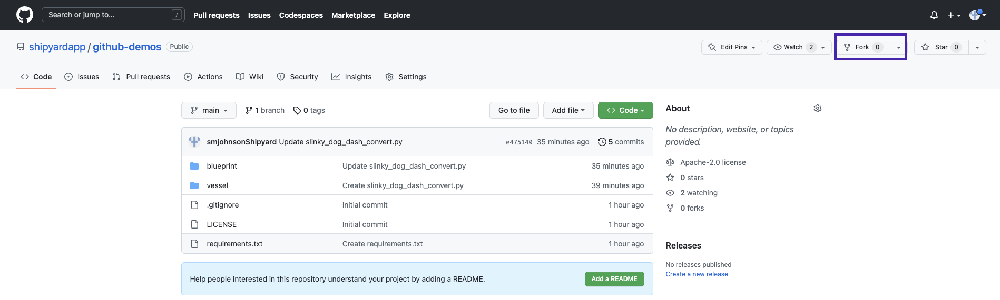

3. Under **Repository Name**, enter `shipyard_github_tutorial`.
4. Click **Create Fork**. This will redirect you to the forked repository on your GitHub account.

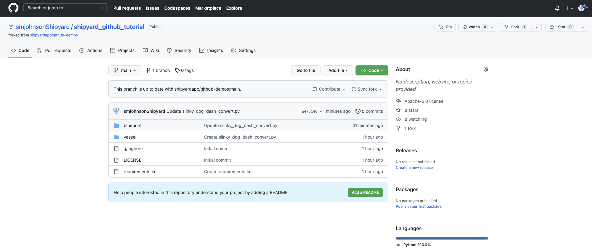

### Step 2: Connecting GitHub to Shipyard

1. Head over to [Shipyard](https://www.shipyardapp.com/) and sign in.
2. Using the sidebar, click on **Admin** to access the drop-down menu.
3. Under Admin, select **Integrations**.

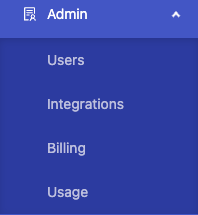

3. Click **GitHub**.
4. Click **Add Connection**.

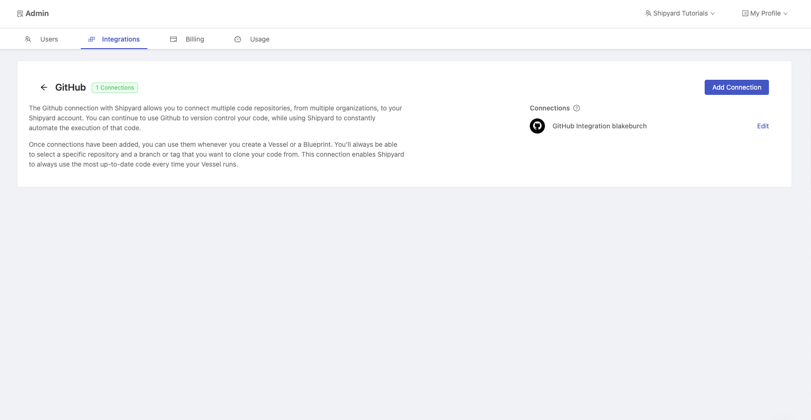

5. You'll be taken to GitHub to sign in then to the GitHub Installations page. Choose the organization where you forked the repository from earlier.

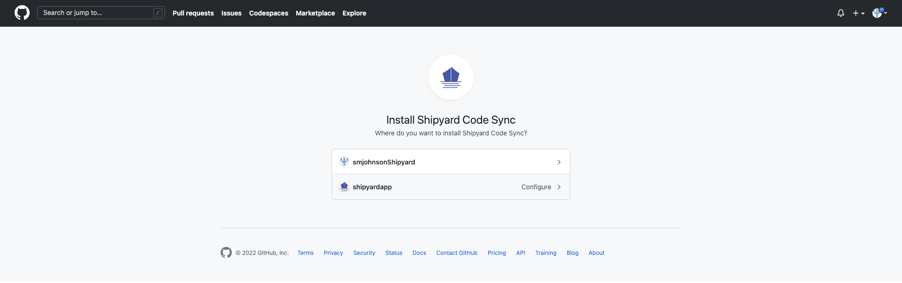

6. Choose to allow Shipyard to have access to all repositories or just the forked repository from earlier. 
7. Click **Install**. This will redirect you back to the Admin page on Shipyard where you will be able to see your GitHub connection on the right side of the page.

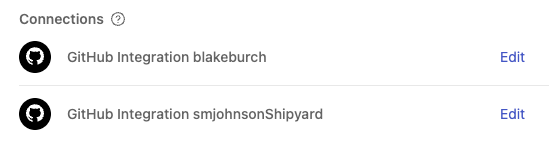

### Step 3: Add GitHub Code Vessel to Fleet

1. On the Shipyard sidebar, select **Projects**.
2. Select the **Default** project where the Getting Started tutorial Fleet lives or the project where you created a new Fleet from the YAML starting point.
3. Select the Fleet named `Download File from Webpage and Email to User`.
4. Select **Fleet Builder** from the top of the page.

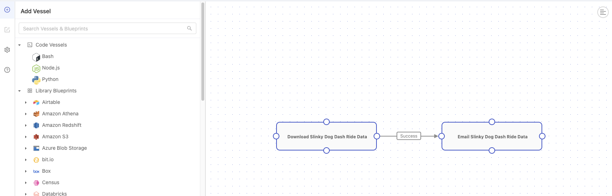

5. Select **Python** to add a code Vessel to the Fleet.
6. Under **Vessel Name**, enter `Convert Minutes to Hours`.
7. Under **File to Run**, enter `vessel/slinky_dog_dash_convert.py`.

:::info
For the file name, we had to include the folder where the file was located in GitHub. The repository will be put into the Shipyard working directory with the GitHub folder structure in tact.
:::

8. Select **Git**.
9.  Under **Repo**, enter the name of your forked repository.
10. Under **Code Source**, select `main`.
11. Under **Git Clone Location**, select `Unpack into Current Working Directory`.
    
:::info Pro-Tip
When running a code Vessel from GitHub, Shipyard parses the repository for a requirements.txt file. The packages in the file will automatically be installed for you.
:::

12. Delete the existing connection between the original two Vessels by hovering over the connection and clicking the red X.

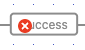

13. Connect `Download Slinky Dog Dash Ride Data` to `Convert Minutes to Hours`.
14. Connect `Convert Minutes to Hours` to `Email Slinky Dog Dash Ride Data`.
    
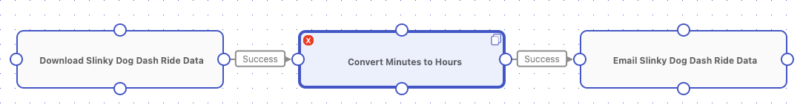

15. Click **Save** on the bottom right corner of your screen.
16. Click **Run Now**. This will start an on-demand run of the Fleet and take you to the [Fleet Log](../reference/logs/fleet-logs.md).
17. After the Fleet completes running, you should see a status of Success and the Vessels all being green on the gantt chart.
    
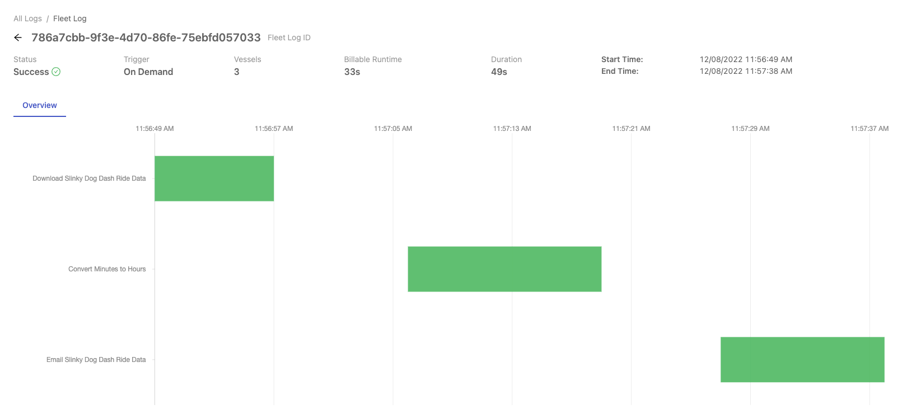

18. In your email, you are able to see the file with wait time in hours and minutes.

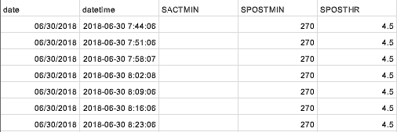

:::tip Success
You've successfully integrated GitHub with Shipyard and used your first script from GitHub in a Fleet!
:::


