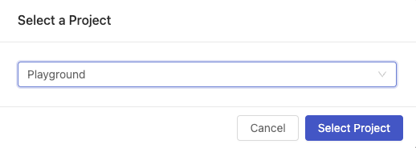

import Tabs from '@theme/Tabs';
import TabItem from '@theme/TabItem';

# Building a Vessel with Code from GitHub

## Overview

In this tutorial, you'll walk through the steps required to set up a Vessel that runs a Python script from GitHub.

By the end of the tutorial, you'll be able to:

- Connect your GitHub account to Shipyard.
- Create a [Vessel](../reference/vessels.md) with a script from GitHub.
- Install [package dependencies](../reference/packages/external-package-dependencies.md) for your solution.
- Check [Logs](../reference/logs/logs-overview.md) to verify that a Vessel ran successfully.

## Setup

:::caution
For the sake of the this tutorial, we are assuming that you have a GitHub account. If you do not, head over to [GitHub](https://github.com/join) and create an account.
:::

The Python script that we will use in this tutorial takes a CSV and averages a column by date. To follow along, you will need to clone this [repository](https://github.com/smjohnsonShipyard/GitHub-demos). 

If you need help cloning a repository, GitHub has you covered with a [tutorial](https://docs.github.com/en/repositories/creating-and-managing-repositories/cloning-a-repository) on how to do just that. Once you have that repository cloned, we are ready to get started!

## Steps

### Step 1: Connecting GitHub to Shipyard

1. Using the sidebar, click on **Admin** to access the drop-down menu.
2. Under Admin, select **Integrations**.

3. Click **GitHub**.
4. Click **Add Connection**.

1. Sign into GitHub if you haven't already. If you are signed in, you will be taken to GitHub to select which GitHub organization you want to connect to Shipyard. Choose the organization where you cloned the repository from earlier.

6. Choose to allow Shipyard to have access to all repositories or just the cloned repository from earlier. 
7. Click **Install**. This will redirect you back to the Admin page on Shipyard where you will be able to see your GitHub connection on the right side of the page.

### Step 2: Creating a Fleet to Download a File from a URL

1. Using the sidebar, click on **New Fleet**.
2. Using the dropdown menu, select the Project that you want to build this example in. 
   

3. Click **Select Project**. This will take you to the Fleet Builder.
4. Under Add Vessel, enter `HTTP` to search for our HTTP Blueprints.
5. Click **Download File from URL**. This will create a Vessel for you in the Fleet Builder.
   

6. Under **Vessel Name**, enter `Download Ride Data`.
7. Under **File URL**, enter `https://cdn.touringplans.com/datasets/slinky_dog.csv`.
8. Under **File Name**, enter `slinky_dog_dash.csv`.

### Step 3: Creating a Vessel with Code from GitHub

1. Click the Plus sign on the side of the Fleet Builder to add another Vessel.
2. Click **Python**. This will create a second Vessel for you in the Fleet Builder.
3. Under **Vessel Name**, enter `Average Wait Time by Day`.
4. Under **File to Run**, enter `http_slinky_dog_dash_average.py`.
5. Select **Git**.
6. Under **Repo**, select the repository where you cloned the code from earlier.
7. Under **Code Source**, select `Main`.
8. Under **Git Clone Location**, select `Unpack into Current Working Directory`.

:::info
Choosing this option will dump all of the files into the working directory in Shipyard. If you choose the default option, the files will be dumped into a folder with the same name as the repo.
:::

9.  Connect the Download Ride Data Vessel to the Average Wait Time by Day Vessel.

:::note
Generally a code Vessel would require installing [Python packages](../reference/packages/external-package-dependencies.md). You are able to do that manually if you wish, however Shipyard will parse your repository for a requirements.txt file and install the required packages automatically.
:::

### Step 4: Creating a Vessel to Send the New File with Email

1. Click the Plus sign on the side of the Fleet Builder to add another Vessel.
2. Under Add Vessel, enter `Email` to search for our Email Blueprints.
3. Click **Send Message with File** to add a new Vessel. 
   

   
4. Under **Vessel Name**, enter `Send Daily Average by Email`.
5. Under **SMTP Host**, enter `smtp.gmail.com`
6. Under **SMTP Port**, enter `587`.
7. Leave **Username**, **Password**, and **Sender Address** with their default values to use our test email for this example.
8. Under **To**, enter your email.
9. Under **Subject**, enter `Daily Ride Wait Time Average`.
10. Under **Message**, enter `Here is Slinky Dog Dash's Daily Wait Time Average`.
11. Under **File Name**, enter `daily_average_for_slinky_dog_dash.csv`.
12. Connect **Average Wait Time by Day** to **Send Daily Average by Email**.
    
Your finished Fleet should look like this: 

13. Click **Save & Finish** on the bottom right of your screen. This will take you to a page letting you know that your Fleet has been created successfully.
14. Click **Run Your Fleet** which will take you to the [Fleet Log](../reference/logs/fleet-logs.md).

Wait for all three Vessels to turn green to indicate that they finished running successfully. 

Once they are finished, you should have an email that shows the daily average CSV that our Python script from GitHub created.

:::tip Success
You've successfully integrated GitHub with Shipyard and used your first script from GitHub in a Fleet!
:::

