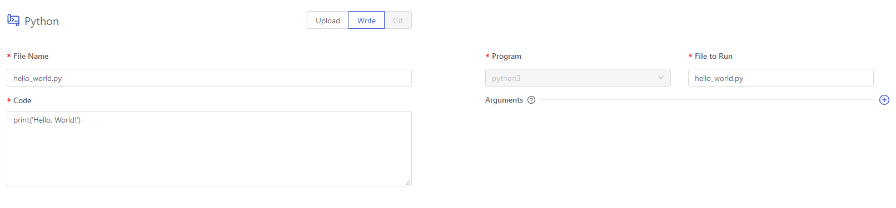
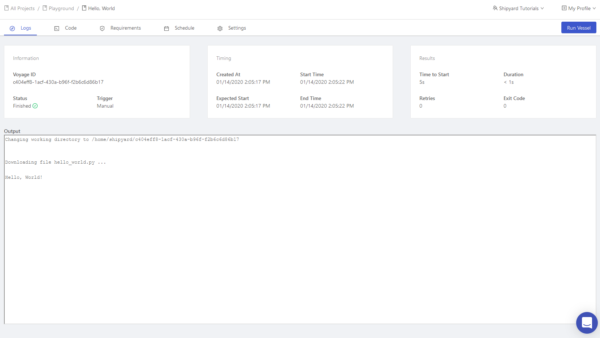

import Tabs from '@theme/Tabs';
import TabItem from '@theme/TabItem';

# Building a "Hello World" Vessel

## Overview

In this tutorial, you'll walk through the steps required to set up a very simple Vessel that prints `Hello, World`. By the end of the tutorial, you will know how to:

- Set up a Vessel using a Code Blueprint
- Write a script directly in the UI.
- Check to verify that a Vessel ran succesfully.

:::caution
**Note:** For the sake of the this tutorial, we suggest starting off by building a Vessel inside of a Project called "Playground". You can follow [**this tutorial** ](building-playground-project.md)to set that up.
:::

## Steps

1. Using the sidebar, click on "Projects" to expand the list of projects.
2. Click on the "Playground" project. You'll be directed to the Vessels tab for the Playground project.
3. Click on the "Build Vessel" button in the top-right corner of the screen.

   

4. A modal will pop up asking you what type of blueprint you would like to use to build your Vessel. On the left side of the modal, you'll see an option for a **Code Blueprint**. Click "Select" for this option.

:::tip Success
You've successfully started the setup flow for building a Vessel using a Code Blueprint!
:::

We'll now walk through the process of filling out the next 5 steps to create our "Hello World" Vessel. Select the tab of either **Python** or **Bash** to get language specific instructions.

### Step 1 - Select a Blueprint

<Tabs
groupId="languages"
defaultValue="python"
values={[
{label: 'Python', value: 'python'},
{label: 'Bash', value: 'bash'},
{label: 'Node', value: 'node'},
]}>
<TabItem value="python">

Click on the **Python** Blueprint. You'll be immediately redirected to the next step.
</TabItem>

<TabItem value="bash">

Click on the **Bash** Blueprint. You'll be immediately redirected to the next step.
</TabItem>
<TabItem value='node'>

Click on the **Node.js** Blueprint. You'll be immediately redirected to the next step.
</TabItem>
</Tabs>

### Step 2 - Provide your Code

On the left side of the screen, select the **Write** button. This will change the fields below to look like the following:

<Tabs
groupId="languages"
defaultValue="python"
values={[
{label: 'Python', value: 'python'},
{label: 'Bash', value: 'bash'},
{label: 'Node', value: 'node'},
]}>
<TabItem value="python">

1. In the field entitled **File Name** write `hello_world.py` . This is now the name of your script.
2. In the field titled **Code** write `print('Hello, World!')` . Your script `hello_world.py` now contains the Python code to print this famous message.
3. On the right-hand side of the screen, there is a field entitled **File to Run**. Because the Code section was set to write, this field will automatically mirror what you typed into **File Name**. It should say `hello_world.py`.
4. Click the "Next Step" button at the bottom of the screen.

</TabItem>

<TabItem value="bash">

1. In the field entitled **File Name** write `hello_world.sh` . This is now the name of your script.
2. In the field titled **Code** write `echo 'Hello, World!'` . Your script `hello_world.sh` now contains the shell command to print this famous message.
3. On the right-hand side of the screen, there is a field entitled **File to Run**. Because the Code section was set to write, this field will automatically mirror what you typed into **File Name**. It should say `hello_world.sh`.
4. Click the "Next Step" button at the bottom of the screen.

</TabItem>
<TabItem value='node'>

1. In the field entitled **File Name** write `helloWorld.js` . This is now the name of your script.
2. In the field titled **Code** write `console.log('Hello, World!')` . Your script `helloWorld.js` now contains the Node.js code to print this famous message.
3. On the right-hand side of the screen, there is a field entitled **File to Run**. Because the Code section was set to write, this field will automatically mirror what you typed into **File Name**. It should say `helloWorld.js`.
4. Click the "Next Step" button at the bottom of the screen.

</TabItem>
</Tabs>

### **Step 3 - Requirements**

For this tutorial, we don't have any environment variables to set up or packages to install. Go ahead and click the **Next Step** button at the bottom of the screen.

### **Step 4 - Settings**

1. Under the information section, give your Vessel the name of `Hello, World`.
2. Under the notifications section, make sure that your email is listed. It should be added by default.
3. Add an additional notification email of "[helloworld@shipyardapp.com](mailto:helloworld@shipyardapp.com)". You'll notice that you can add any user or alias to the notification list, whether or not they have access to your organization.
4. Click the **Save & Finish** button at the bottom of the screen.

:::note
Not every step will be required. The necessary settings depend entirely on the solution you build and it's complexity.
:::

### Step 5 - Running the Vessel

You should see the following screen:

Go ahead and click **Run Your Vessel**. This will schedule your Vessel to run immediately and redirect you to **Individual Log** page.

### Step 6 - Checking the Logs

You should have been redirected to the following page that shows you all of the details about the specific Log you clicked.

:::caution
If the Vessel has a Status of **Scheduled or Running** you may see sections of this page that are incomplete.

Wait a few seconds for your Vessel to begin running. The page will automatically refresh with updates.
:::

In the output, you'll see a total of 3 things.

1. Shipyard creates a working directory under `/home/shipyard/{voyage_id}`
2. Shipyard downloads the file you created under the [Code](building-a-hello-world-vessel.md#step-2-provide-your-code) section.
3. Shipyard prints the text `Hello, World!`

:::tip Success
You've successfully created and verified a Vessel!
:::

Now that you've completed the basics of building a Vessel, try out the next tutorial!
