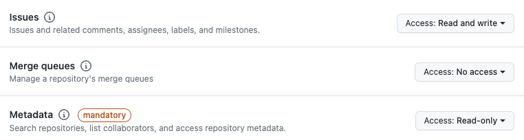
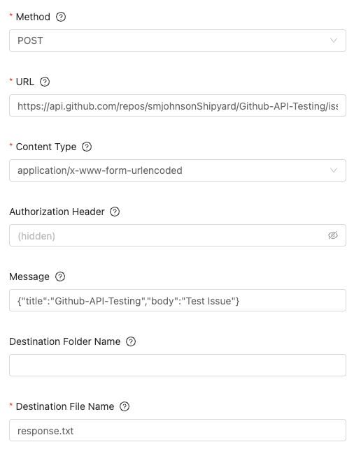
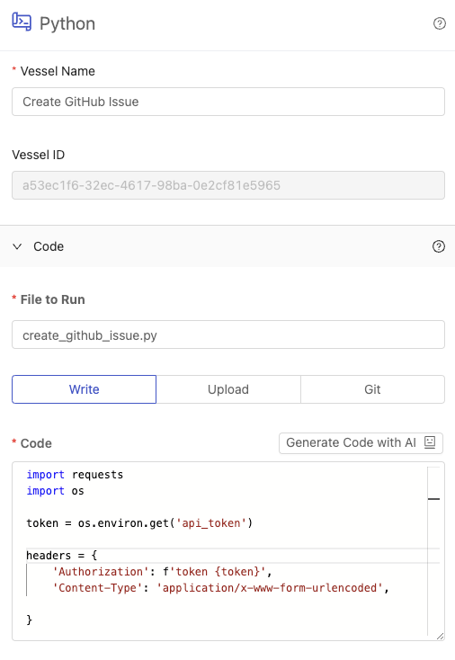
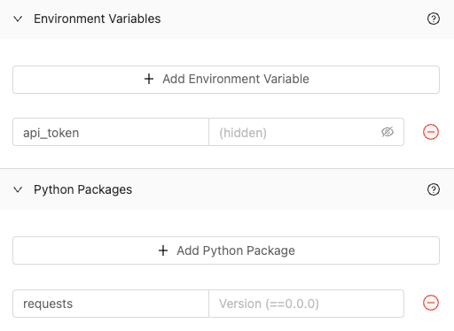
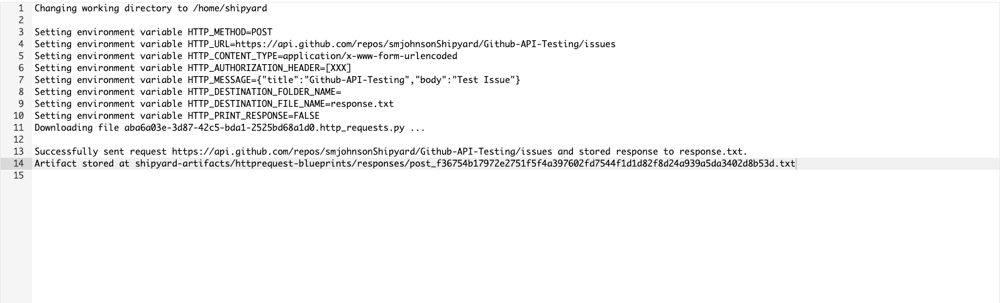
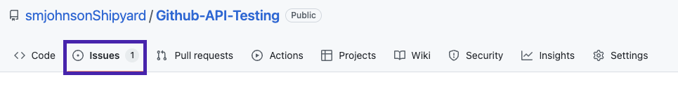
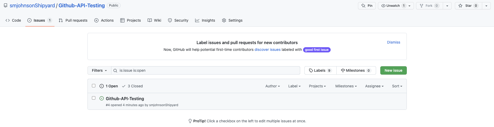
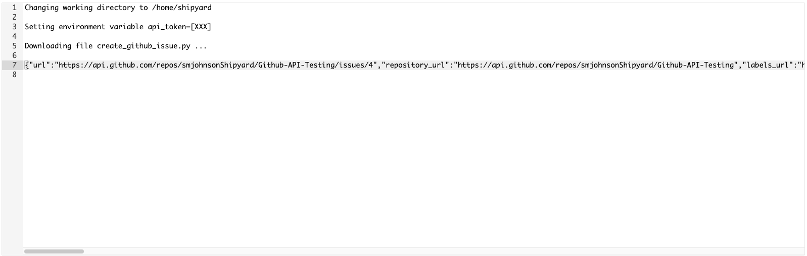

import Tabs from '@theme/Tabs';
import TabItem from '@theme/TabItem';

# Calling an API

## Overview

In this tutorial, we will walk through the steps needed to make an API call in Platform. This guide will accomplish that using Platform's native [HTTP](../blueprint-library/http/http-requests.md) Blueprint. If you'd rather use your own Python script, the steps are provided to do that as well.

We will be calling GitHub's API to create an issue in a repository. 

By the end of this tutorial, you'll be able to: 

- Call an API using the Request native Blueprint
- Call an API using a Python code Vessel

## Steps

### Step 1: Generating API Key

1. Head [here](https://docs.github.com/en/authentication/keeping-your-account-and-data-secure/creating-a-personal-access-token) and follow GitHub's guide to create an API Key.
2. Under **Repository Permissions**, change the access for Issues to have read and write access and Metadata to have read-only access.



### Step 2: Calling GitHub's API

1. In Platform, click **New Fleet** in the top left corner. This will take you to the Fleet Builder.

<Tabs
groupId="vessel-type"
defaultValue="native"
values={[
{label: 'Native Blueprint', value: 'native'},
{label: 'Code', value: 'code'},
]}>
<TabItem value="native">

2. Under **HTTP**, select **Requests**. This will create a Vessel for you in the Fleet Builder.
3. Under **Vessel Name**, enter `Create GitHub Issue`.
4. Under **Method**, select **POST**.
5. Under **URL**, enter `https://api.github.com/repos/YOUR_GITHUB_USERNAME/YOUR_REPOSITORY_NAME/issues` and insert your username and repository name in the marked spots.
6. Under **Content Type**, select **application/x-www-form-urlencoded**.
7. Under **Authorization Header**, enter `token YOUR_API_CREDENTIAL`, replacing YOUR_API_CREDENTIAL with your actual API credential from GitHub.
8. Under **Message**, enter `{"title":"YOUR_REPOSITORY_NAME","body":"Test Issue"}`, replacing YOUR_REPOSITORY_NAME with your actual repository name.



:::info
You can connect a Vessel to the Request Vessel to receive the API response by sending response.txt with Slack or Email or storing it in a Cloud Storage Container. 
:::

9. Click **Save & Finish** on the bottom right of your screen. This will take you to a page letting you know that your Fleet has been created successfully. 
10. Click **Run Now**. This will take you to the [Fleet Log](../reference/logs/fleet-logs.md) page for your Fleet run.

</TabItem>

<TabItem value="code">

3. Under **Code Vessels**, select **Python**. This will create a Vessel for you in the Fleet Builder.
4. Under **Vessel Name**, enter `Create GitHub Issue`.
5. Under **File to Run**, enter `create_github_issue.py`.
6. Under **Code**, enter:

```python
import requests
import os

token = os.environ.get('API_TOKEN')

headers = {
    'Authorization': f'token {token}',
    'Content-Type': 'application/x-www-form-urlencoded',
    
}

data = '{"title":"YOUR_REPOSITORY_NAME","body":"Test Issue"}'

response = requests.post('https://api.github.com/repos/YOUR_GITHUB_USERNAME/YOUR_REPOSITORY_NAME/issues', headers=headers, data=data)

print(response.text)
```


7. In the code, you will need to replace the instance of `YOUR_REPOSITORY_NAME` with your specific repository name and `YOUR_GITHUB_USERNAME` with your GitHub name.
8. Click **Environment Variables**.
9.  Click **Add Enivronment Variable**.
10. In the **name** field, enter `API_TOKEN`

:::info
The environment variable that we just created is accessed in the code using the line os.environ.get('API_TOKEN').
:::

12. In the **hidden** field, enter the API Token that you generated earlier from GitHub.
13. Click **Python Packages**.
14. Click **Add Python Package**
15. In the **name** field, enter requests.
    


16. Click **Save & Finish** on the bottom right of your screen. This will take you to a page letting you know that your Fleet has been created successfully. 
17. Click **Run Now**. This will take you to the [Fleet Log](../reference/logs/fleet-logs.md) page for your Fleet run.

</TabItem>
</Tabs>

### Step 3: Verify that the Issue was Created

<Tabs
groupId="vessel-type"
defaultValue="native"
values={[
{label: 'Native Blueprint', value: 'native'},
{label: 'Code', value: 'code'},
]}>
<TabItem value="native">

1. Once the Fleet has finished running successfully, click the green rectangle from the gantt chart to view the Vessel log.
2. The Vessel log confirms that the request was successfully sent to the API.



3. Over in Github, navigate to the repository where you created the issue.
4. Select **Issues**.



5. You can see the Issue that we created using the API listed.



:::tip success
You've successfully used Platform to create an issue in GitHub using an API call.
:::
</TabItem>

<TabItem value="code">

1. Once the Fleet has finished running successfully, click the green rectangle from the gantt chart to view the Vessel log.
2. The Vessel log has the response from the API printed. You should be able to see the url of the Issue created.



3. Over in Github, navigate to the repository where you created the issue. 
4. Select **Issues**.


5. You can see the Issue that we created using the API listed.


:::tip success
You've successfully used Platform to create an issue in GitHub using an API call.
:::
</TabItem>
</Tabs>

