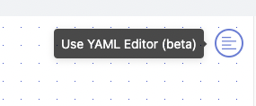

# Move a Fleet from One Project to Another

## Overview

In this tutorial, you'll walk through the steps to move a fleet using Shipyard's [YAML Editor](../reference/fleets/yaml-editor.md). 

By the end of this tutorial, you'll be able to: 

- Move a Fleet with the YAML Editor

For more information about our YAML Editor, check out this [blog post](https://www.shipyardapp.com/blog/facilitating-workflow-as-code/) that covers the basics of using the YAML Editor.

:::info

This method also works to move Fleets from one organization to another.

:::

## Steps

### Step 1 - Copy Original Fleet's YAML Code

1. Navigate to the Fleet that you want to move.
2. Click the **Use YAML Editor** button on the top right of the Fleet Builder page.

3. Highlight and copy all of the existing YAML.

### Step 2 - Create Fleet in New Project

1. Click the **New Fleet** button on the top left corner of your screen to create a new Fleet.
2. Choose which Project you would like to move the original Fleet into. 
3. Click the **Use YAML Editor** button on the top right of the Fleet Builder page.
4. Delete the generated YAML.
5. Paste the original Fleet's YAML. 
6. Delete the Fleet and Vessel IDs from the YAML code.
7. Click **Save & Finish Fleet**.

:::tip Success

You've successfully moved a Fleet from one project to another!

:::

<iframe src="https://demo.arcade.software/MyhXJI3nm5ewtWZ6QvOx?embed" frameborder="0" loading="lazy" webkitallowfullscreen mozallowfullscreen allowfullscreen style="position: absolute; top: 0; left: 0; width: 100%; height: 100%;color-scheme: light;" title="How to Move a Fleet"></iframe>
` }} />