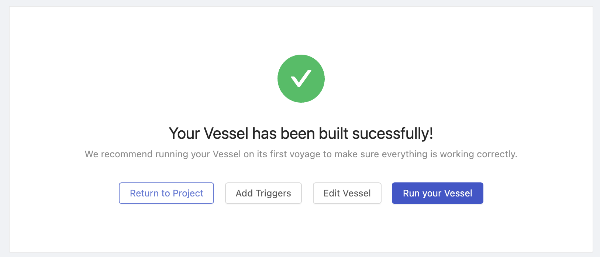
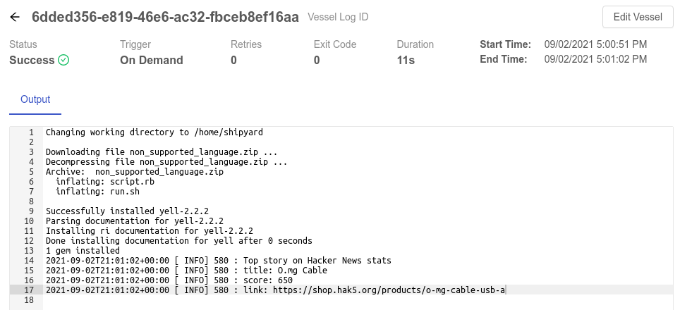
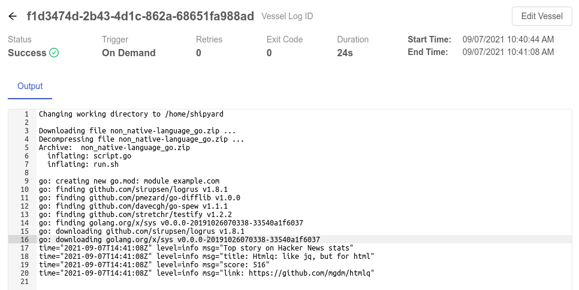

import Tabs from '@theme/Tabs';
import TabItem from '@theme/TabItem';

# Building Non-Native Language Vessels

## Overview

**Shipyard** provides indirect support for languages outside of those natively supported (Bash, Python, and Node). This is done by using Bash Vessels to install the given language and any external packages before running the specified command to execute the script. With this approach, the user can effectively use whatever language they choose in Vessel construction.

Note that this approach will likely add in some additional execution time for the Vessel due to the installation and setup going into each Vessel run.

In this walk through, you'll construct a Vessel using a [language not natively supported](../reference/code/code-overview.md) in the platform.

By the end of the tutorial, you'll be able to:

- Set up a [Vessel](../reference/vessels.md)
- Use a non-natively supported language for the code
- Install third-party packages in that language
- Fetch data from an external API
- See output in the [Logs](../reference/logs/logs-overview.md)

## Setup

Getting started with this walkthrough is fairly straight-forward.

<Tabs
groupId="languages"
defaultValue="ruby"
values={[
{label: 'Ruby', value: 'ruby'},
{label: 'Go', value: 'go'},
]}>
<TabItem value="ruby">

First, [download this zipped Ruby code](https://drive.google.com/file/d/1kPO76_I6RlJoRvmFTR3hEZ253wp56Qi-/view?usp=share_link), named `non_native_language_ruby.zip` to your computer without making any changes.

Feel free to review the code in both `run.sh` and `script.rb` to see what each is doing. Here's a brief overview:

1. `run.sh`: this is the "entrypoint" for our Vessel code since Bash, not Ruby, is natively supported in Shipyard  
	a. Updates an environment variable (to suppress a warning in the logs)  
	b. Installs the third-party package `yell`  
	c. Runs the Ruby script  
2. `script.rb`: this is the core of the code and is written entirely in Ruby  
	a. Fetches the top stories from the Hacker News API  
	b. Gets an ID from the top stories response data  
	c. Fetches the story by the ID  
	d. Prints information using the `yell` package  

</TabItem>
<TabItem value="go">

First, [download this zipped Go code](https://drive.google.com/file/d/1mKQiWWLSWYQmBuHVVla5wNms6osbTCB-/view?usp=share_link), named `non_native_language_go.zip` to your computer without making any changes.

Feel free to review the code in both `run.sh` and `script.go` to see what each is doing. Here's a brief overview:

1. `run.sh`: this is the "entrypoint" for our Vessel code since Bash, not Go, is natively supported in Shipyard  
	a. Initializes Go modules for third-party packages  
	b. Installs the third-party package `logrus`  
	c. Runs the Go script  
2. `script.go`: this is the core of the code and is written entirely in Go  
	a. Fetches the top stories from the Hacker News API  
	b. Gets an ID from the top stories response data  
	c. Fetches the story by the ID  
	d. Prints information using the `logrus` package  

</TabItem>
</Tabs>

## Steps

### Step 1 - Build a Fleet with a Bash Vessel

1. Click the **+ New Fleet** button on the left sidebar.
2. Click the plus icon along the left side of the Fleet Builder sidebar.
3. Click on the **Bash** option under Code Vessels.

### Step 2 - Fill Out Details

<Tabs
groupId="languages"
defaultValue="ruby"
values={[
{label: 'Ruby', value: 'ruby'},
{label: 'Go', value: 'go'},
]}>
<TabItem value="ruby">

#### Information Panel
1. Give your Vessel the name of `Non-Native Language - Ruby`.

#### Code Panel
1. Type `run.sh` into the **File to Run** field.
2. In the radio button options, select **Upload**.
3. Click on the grey square with the text **"Click or drag file to this area to upload"** and upload the previously downloaded `non_native_language_ruby.zip` file.

#### Bash Packages Panel
1. Click the **+ Add Bash Package** button add a new package.
2. In the **Package Name** field, type `ruby-full`.

</TabItem>
<TabItem value="go">

#### Information Panel
1. Give your Vessel the name of `Non-Native Language - Go`.

#### Code Panel
1. Type `run.sh` into the **File to Run** field.
2. In the radio button options, select **Upload**.
3. Click on the grey square with the text **"Click or drag file to this area to upload"** and upload the previously downloaded `non_native_language_go.zip` file.

#### Bash Packages Panel
1. Click the **+ Add Bash Package** button add a new package.
2. In the **Package Name** field, type `golang`.

</TabItem>
</Tabs>

Once all of the above information has been filled in, click the **Save & Finish** button at the bottom of the screen.

### Step 3 - Run the Fleet

1. Click the **Run your Fleet** button. This will kick off an [On Demand trigger](../reference/triggers/on-demand-triggers.md) and redirect you to the [Fleet Log](../reference/logs/fleet-logs.md) page.

2. Click into the [Vessel Log](../reference/logs/vessel-logs.md) by clicking the gantt chart or clicking the Vessel Log ID in the table.

You should see the following page that shows you all of the details about the specific Log.

In the output, you'll see several things.

1. Shipyard creates a working directory under `/home/shipyard/`
2. Shipyard downloads the file you created under the Code section, decompresses it, and begins to run `run.sh`
3. Shipyard prints out the text `Top story on Hacker News stats` followed by the `title`, `score`, and `link` values

<Tabs
groupId="languages"
defaultValue="ruby"
values={[
{label: 'Ruby', value: 'ruby'},
{label: 'Go', value: 'go'},
]}>
<TabItem value="ruby">

</TabItem>
<TabItem value="go">

</TabItem>
</Tabs>

:::tip success
You've successfully created and verified a Vessel using a non-native language.
:::
