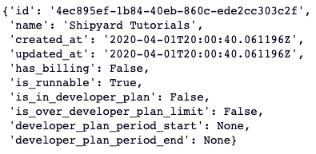

# Fetching Your Org ID with the Shipyard API

## Overview

**Shipyard's** [API](https://shipyard.readme.io) gives a user the opportunity to create and edit Fleets along with looking at historical runs. However, every API end point requires an org ID to call them. The only way to access your org ID is through the Shipyard API. 

In this tutorial, we will walk through the steps needed to call the Shipyard API to get your org ID.

:::note
This tutorial will walk through the API call in Python, however you can call the API using the language of your choice.
:::

## Setup

All you need to get started with this tutorial is a Shipyard API key and a coding environment. To generate an API key, head over to the Shipyard API [authorization page](../blueprint-library/shipyard-api/shipyard-api-authorization.md). For a coding environment, you are free to use your tool of choice such as Visual Studio Code or Hex.

## Steps

1. Head over to your coding environment and paste the following code into your editor:

```python
import requests
import json

api_key = 'YOUR_API_KEY'

headers = {
    'X-Shipyard-API-Key': f'{api_key}',
}

response = requests.get('https://api.app.shipyardapp.com/orgs', headers=headers)
org = json.loads(response.text)
print(org['data'])
```

2. Substitute your API key at the top of the script with the YOUR_API_KEY string.
3. Run the script. The printed output should look like this:
   


4. You are able to get your org ID from the value of the ID key in that dictionary. 

:::tip success
You've successfully fetched your API key with the Shipyard API.
:::