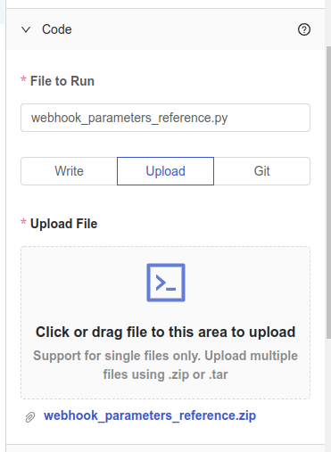
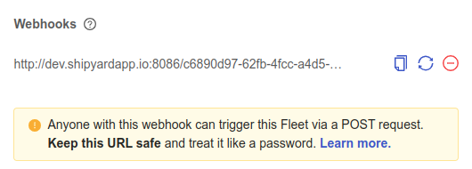
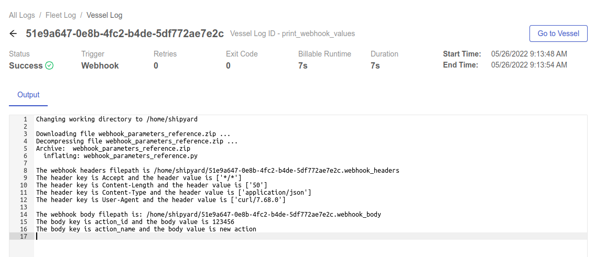
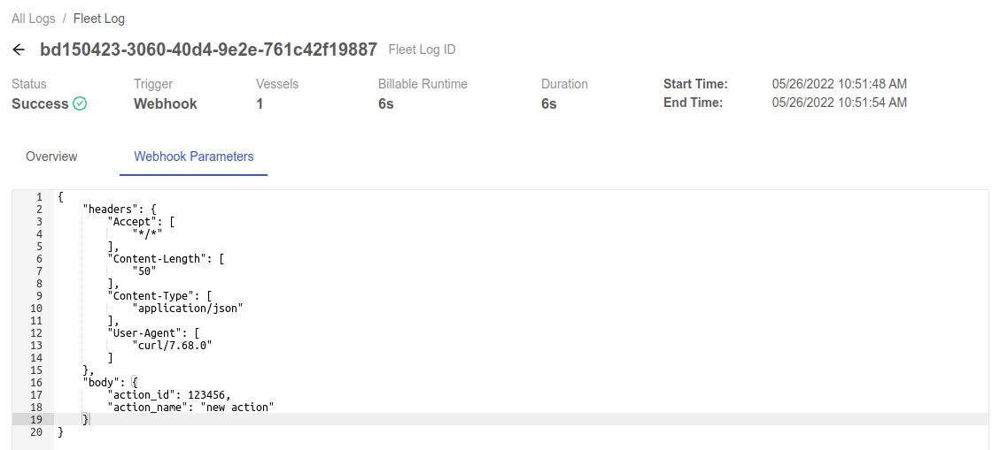

import Tabs from '@theme/Tabs';
import TabItem from '@theme/TabItem';

# Building Vessels to Reference Fleet Webhook Parameters

## Overview

In this tutorial, you'll learn to build a Fleet that contains a Vessel that can parse the received **webhook parameters**. This tutorial is only in Python \(for now\).

By the end of the tutorial, you'll be able to:

- Set up a [Vessel](../reference/vessels.md) with Code
- [Upload a script](../reference/code/upload-code.md) to Platform.
- Reference [platform environment variables](../reference/environment-variables/shipyard-environment-variables.md)
- Check [Logs](../reference/logs/logs-overview.md) to verify that a Vessel correctly referenced the **webhook parameters**.

## Setup

First, [download this code](https://drive.google.com/file/d/1TYvbvxNgkaBJkE2mC5A81SzGzSIfLVH4/view?usp=sharing), named `webhook_parameters_reference.zip` to your computer without making any changes.

Feel free to peruse this script beforehand so you understand everything that it's doing. The script is accomplishing four main things:

1. Reads in the Platform environment variables for the paths to the conditional headers and body files.
2. Conditionally reads in the headers and body files (the body is assumed to be a JSON file in this example).
3. Loops over the key-value pairs for both files and prints each one out

In the event that either headers or body are not provided in the webhook invocation, those loops are skipped.

## Steps

Using the sidebar, click **+ New Fleet**. You'll now be on the Fleet builder canvas. Next we'll walk through the process of building the required Vessel and invoking the Fleet with a webhook.

### Step 1 - Create a Code Vessel

1. Click **Python** under the _Code Vessels_ dropdown.
2. Under the _Code_ dropdown in the **File to Run** input, type `webhook_parameters_reference.py`.
3. Click the **Upload** toggle option.
4. Click the **Upload File** button and select the `webhook_parameters_reference.zip` downloaded in the **Setup** section above.
5. Click **Save & Finish** in the bottom right corner of the canvas.



### Step 2 - Add a Fleet Webhook

1. On the success page, click the **Add Triggers** button.
2. Under the _Triggers_ tab, click the **Add Webhook** button on the right side of the screen.
3. Copy and paste the generated URL for **Step 3** below.



:::caution
Your generated URL will be different than the one pictured above.
:::

### Step 3 - Invoke the Fleet Webhook

1. Open up a browser and navigate to [this URL](https://reqbin.com/curl).
2. Copy and paste the code below into the text box while replacing the `<webhook_url>` value with the one generated in **Step 2**.

```
curl -X POST <webhook_url> -H "Content-Type: application/json" -d '{"action_id": 123456, "action_name": "new action"}'
```

3. Click the **Send** button.

### Step 4 - Examing the Webhook Parameters

1. Click on the **Logs** tab on the Platform browser tab.
2. Click on the Fleet in the **Runtime History** histogram (it may be yellow if running or green if complete).
3. Click on the Vessel in the **Overview** tab (it may be yellow if running or green if complete).
4. You'll see the output in the logs showing the headers and body values.



5. Click the back arrow to the left of the Vessel Log ID.
6. Click on the **Webhook Parameters** tab to see the values received from the webhook in JSON format.



:::tip success
You have successfully created a Fleet with a Vessel that can parse the received **webhook parameters**.
:::
