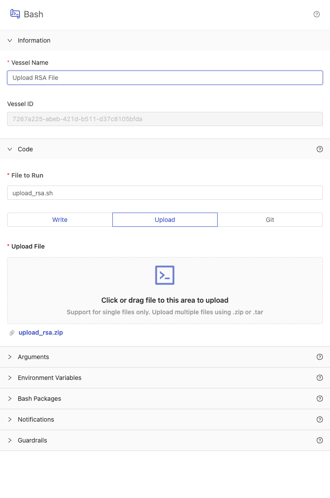
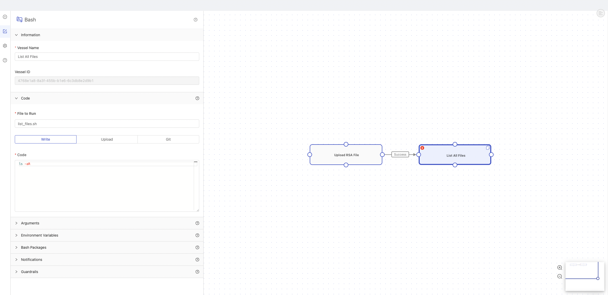
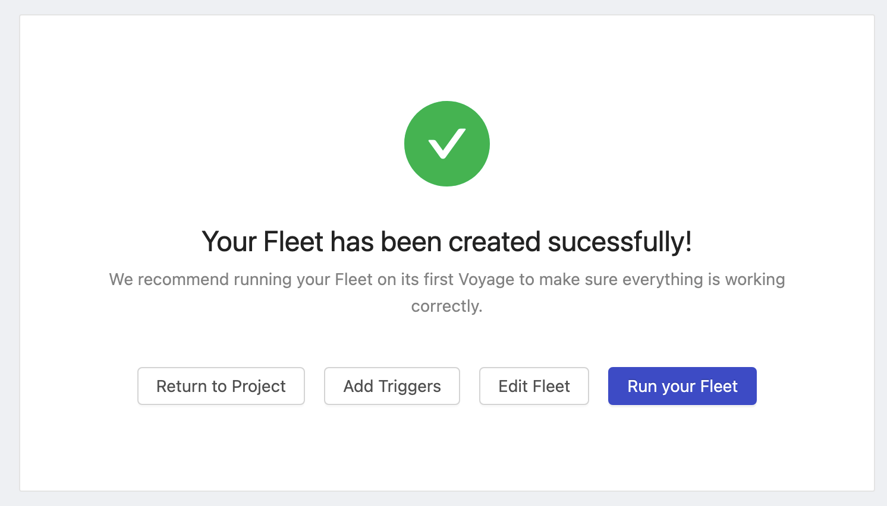
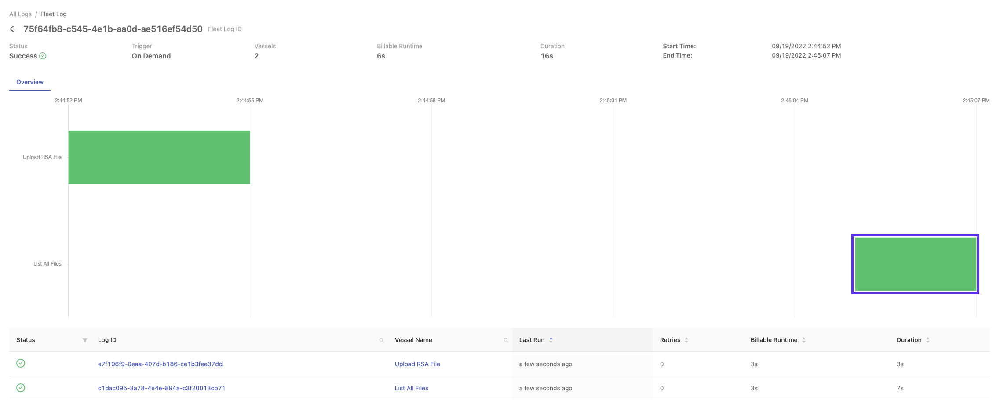
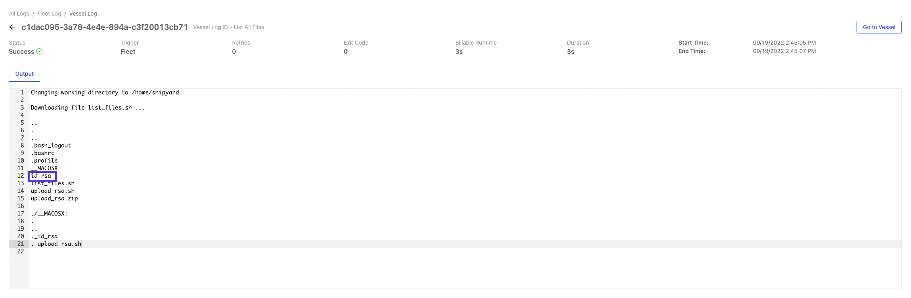

# Upload a Local File

## Overview

In this tutorial, you'll learn how to upload a local file to be used in a Fleet. We do not recommend this process for data uploads. It can be helpful to upload credentials like the RSA key that we will upload in this tutorial. 

By the end of the tutorial, you'll be able to:

- [Upload a script](../reference/code/upload-code.md) to Shipyard.
- Check [Logs](../reference/logs/logs-overview.md) to verify that your local file was uploaded.

:::caution
We do not recommend using this process to upload data. We recommend that you download data files using our native cloud storage Blueprints.
:::

## Setup

First, [download this zip file](https://drive.google.com/file/d/1dlxUFR9MxKdtsO-AdWPEfsWgA2_rr2oc/view?usp=sharing), named `upload_rsa.zip` to your computer without making any changes.

Feel free to peruse this script beforehand so you understand everything that it's doing. The script is accomplishing two main things:

1. Runs a bash script that returns a 0 exit code.
2. Allows the RSA key to be uploaded into Shipyard.

## Steps

1. Using the sidebar, click **+ New Fleet**.
2. In the **Select a Project** dropdown, choose either the *Playground* or *Testing* Project.

You'll now be on the Fleet builder canvas. Next we'll walk through the process of building the required Vessel to upload the file to Shipyard

### Step 1 - Create a Code Vessel

1. Click **Bash** under the _Code Vessels_ dropdown.
2. Under **Vessel Name**, enter `Upload RSA File`.
3. Under the _Code_ dropdown in the **File to Run** input, type `upload_rsa.sh`.
4. Click the **Upload** toggle option.
5. Click the **Upload File** button and select the `upload_rsa.zip` downloaded in the **Setup** section above.

### Step 2 - Create a Vessel to Check Shipyard File System

1. Click the **Add Vessel** button to add a second Vessel.
2. Click **Bash** to add a Bash code Vessel.
3. Under **Vessel Name**, enter `List All Files`.
4. Under **File to Run**, enter `list_files.sh`.
5. Under **Code**, enter `ls -aR`.
6. Connect the Upload RSA File and List All Files Vessels.

### Step 3 - Name your Fleet

1. Click the cog for **Fleet Settings** on the left side of the Fleet Builder.
2. Under **Fleet Name**, enter `Upload RSA File to Shipyard`.

3. Click **Save & Finish** on the bottom right corner of your screen. This will redirect you to a page that lets you know that your Fleet has been created successfully.

4. Click **Run Your Fleet**. This will redirect you to the [Fleet Log page](../reference/logs/fleet-logs.md).

### Step 4 - Check for your File

1. Wait for your Fleet to complete running with a status of Success.
2. Click the green rectangle for the List All Files Vessel.

3. This takes you to the [Vessel Log](../reference/logs/vessel-logs.md).
4. You are able to see the `id_rsa` file that we wanted to upload from our computer in the Shipyard file system.

:::tip success
You have successfully created a Fleet with a Vessel that can upload a file to use in Shipyard from your local file system.
:::