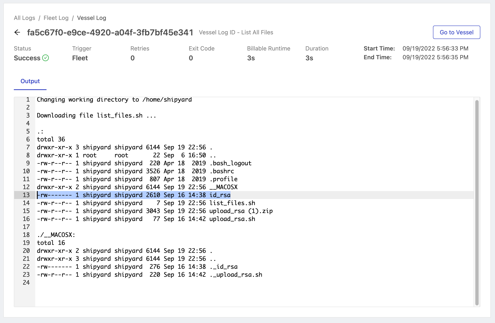

# Upload a Local File

## Overview

In this tutorial, you'll learn how to upload a file from your computer to Shipyard that can be used in a Fleet. This can be helpful to upload static credential or reference files, such as RSA keys.

By the end of the tutorial, you'll be able to:

- [Upload a script](../reference/code/upload-code.md) to Shipyard.
- Check [Logs](../reference/logs/logs-overview.md) to verify that your local file was uploaded.

:::caution
We do not recommend using this process to upload dynamic data files. We recommend that you download data files using our [Library Blueprints](../reference/blueprints/blueprint-library/blueprint-library-overview.md).
:::

## Setup

First, [download this zip file](https://drive.google.com/file/d/1dlxUFR9MxKdtsO-AdWPEfsWgA2_rr2oc/view?usp=sharing), named `upload_rsa.zip` to your computer without making any changes.

Feel free to peruse this zip file beforehand so you understand the contents and purpose. The zip file contains two files:

1. `upload_rsa.sh` - A bash script that prints a success message and returns a 0 exit code.
2. `id_rsa` - The RSA key file to be uploaded into Shipyard.

## Steps

Using the sidebar, click **+ New Fleet**. You'll now be on the Fleet builder canvas. Next we'll walk through the process of building the required Vessel to upload the file to Shipyard

### Step 1 - Create a Code Vessel

1. Click **Bash** under the _Code Vessels_ dropdown.
2. Under **Vessel Name**, enter `Upload RSA File`.
3. Under the _Code_ dropdown in the **File to Run** input, type `upload_rsa.sh`.
4. Click the **Upload** toggle option.
5. Click the **Upload File** button and select the `upload_rsa.zip` downloaded in the **Setup** section above.

:::info Pro Tip
When you [upload files](../reference/code/upload-code.md) to Shipyard using this method, they will be automatically unzipped. Only a single specified file (in this tutorial, `upload_rsa.sh`) can ever be run per Vessel. Future downstream Vessels can run and access the files in the zipped file.
:::

### Step 2 - Create a Vessel to Check Shipyard File System

1. Click the **Add Vessel** button to add a second Vessel.
2. Click **Bash** to add a Bash code Vessel.
3. Under **Vessel Name**, enter `List All Files`.
4. Under **File to Run**, enter `list_files.sh`.
5. Under **Code**, enter `ls -laR`.
6. Connect the Upload RSA File and List All Files Vessels.

### Step 3 - Name your Fleet

1. Click the cog for **Fleet Settings** on the left side of the Fleet Builder.
2. Under **Fleet Name**, enter `Upload RSA File to Shipyard`.

3. Click **Save & Finish** on the bottom right corner of your screen. This will redirect you to a page that lets you know that your Fleet has been created successfully.

4. Click **Run Your Fleet**. This will redirect you to the [Fleet Log page](../reference/logs/fleet-logs.md).

### Step 4 - Check for your File

1. Wait for your Fleet to complete running with a status of Success.
2. Click the green rectangle for the List All Files Vessel.

3. This takes you to the [Vessel Log](../reference/logs/vessel-logs.md).
4. You are able to see the `id_rsa` file that we wanted to upload from our computer in the Shipyard file system.

:::tip success
You have successfully created a Fleet with a Vessel that can upload a file to use in Shipyard from your local file system. 

Use this process in any of your own Fleets by connecting the "Upload Local File Vessel" before another Vessel.
:::

