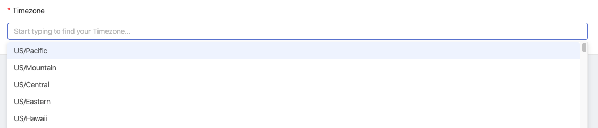

# Build a Playground Project

For the sake of all of our tutorials, we suggest creating a new project called "Playground". This will serve as an area for you to freely explore the functionality of Shipyard without the fear of affecting anything else in the platform.

### Creating your "Playground" Project

1. Using the navigation on the left-side of the screen, click on "Projects". This will cause the navigation menu to expand.
2. Click on **View All Projects**. This will take you to the "All Projects" page.  
  
   If this is your first time in the platform, you'll see the following screen:  

     

3. Click the **New Project** button in the top-right corner of the screen.  

   

4. Give your project a name of "Playground".
5. In the timezone field, start typing `Central` .
6. Select the "US/Central" time zone by clicking the name.


**Note**: Feel free to search for and select your own time zone instead


7. Click the "Create" button in the bottom-right corner of the screen.


You've now successfully created your Playground project! You should see the following screen:


You've now successfully created your Playground project! You should see the following screen:

